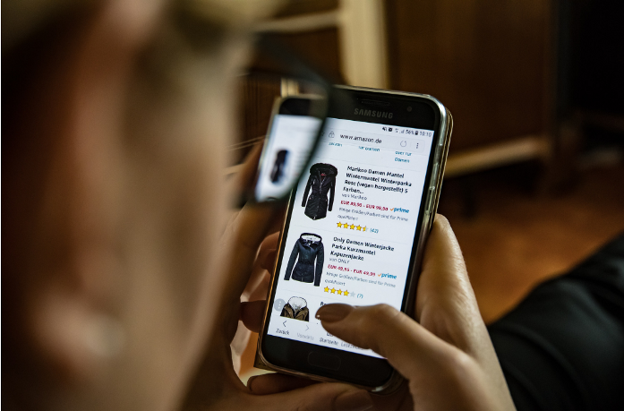

--- 
date: '2020-04-04' 
title: 'Servicios digitales, gastos hormiga para los Millennials' 
image: 'gastos-en-linea.png'
imageAlt: 'Los gastos hormiga por internet se han vuelto mas comunes'
--- 

La generación ***Millennial*** vive inmersa en servicios digitales que han evolucionado y siguen creciendo junto a ellos. Esto ha llevado a que startups resuelvan la necesidad de la inmediates en servicios como música, entretenimiento o transporte.   

Algunos ejemplos de ello son: Streaming (Spotify, Netflix, Amazon video), Ride-hailing (Uber, Bolt, Didi), Micro mobility (Scooters, Bikes), Ecommerce (Amazon, Mercado Libre, Ebay) y Food Delivery (Rappi, Uber Eats, Didi Food) por mencionar algunos de los más importantes y presentes en la vida social de esta generación.   

Esto cambios tecnológicos nos han dado una cantidad masiva de contenido y de calidad diferente a lo que se tenía hace 20 años cuando el internet aún estaba en la etapa de prueba para muchas empresas. El mayor ejemplo de innovación y capitalización de esta tendencia es Google, YouTube y redes sociales como Facebook y Twitter.   

  

Estas industrias encontraron una mina de oro en el modelo de suscripción. Ahora haremos un pequeño ejercicio de gastos mensuales aproximados, tomando en cuenta que se tenga una suscripción mensual y se usen las apps de movilidad como de food delivery frecuentemente, por ejemplo:   

Streaming: **Spotify** $99 pesos, **Netflix** (una pantalla) $129 pesos.   

Movilidad: **Uber** $70 pesos costo de viaje promedio, Scooter **Grin** $45 pesos promedio.   

Suscripciones mensuales: **Rappi** prime (envíos sin costo) $139 pesos, **Amazon** prime $99 pesos, envio sin costo (prime) incluye Amazon video.   

Food delivery: **Uber Eats** $80 promedio sin contar envío.   

Con solo tomar estos gastos, tenemos la cantidad de $661 pesos mensuales. Cabe recalcar que se pueden utilizar varias veces al mes las apps de movilidad y de food delivery, por lo que el gasto puede rondar los $1200 pesos mensuales ($14,400 al año)   

Te invitamos a realizar tu propio ejercicio. ¿Cuántos servicios pagas al mes? Te dejamos algunos consejos para disminuir tu gasto.   

+ ¿Es necesario pagar dos servicios similares como Amazon video $99 y Netflix $129?

+ Revisa y compara los paquetes familiares como en Spotify.

+ Busca la mejor ruta en Google Maps para llegar a tu destino. Puedes combinar transporte público y apps de movilidad.

+ Trata de llevar comida en lugar de comprar desde aplicaciones. Acudir a comercios de comida locales, puede reducir tu gasto y ayudas a su economía.   

Crear un presupuesto y apegarte a el, puede ayudarte a reducir significativamente tus gastos hormiga.   

Próximamente en ***[Oasis Financiero](https://www.oasisfinanciero.mx)*** podrás comparar todas las opciones Fintech y de Banca tradicional en una sola plataforma.   

Síguenos en nuestras páginas de **[Facebook](https://facebook.com/oasisfinanciero)**, **[LinkedIn](https://www.linkedin.com/company/oasisfinanciero/)** y **[Twitter](https://twitter.com/oasisfintech)**.