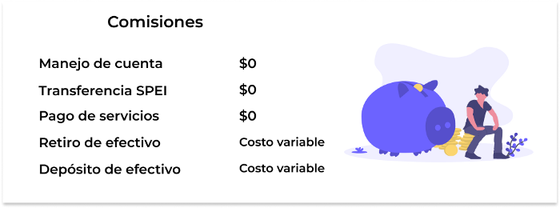
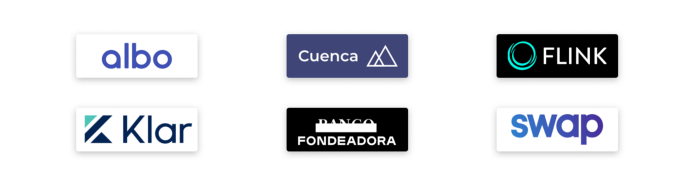

--- 
date: '2020-05-15' 
title: 'Cuentas de ahorro digitales ¿Qué opciones existen?' 
image: 'cuentas-ahorro-digitales.png'
imageAlt: 'Opciones de cuentas de ahorro'
--- 

Acudir al banco, pasar horas esperando y no tener los documentos necesarios para abrir una cuenta bancaria es una historia amarga que la mayoría podríamos tener. Afortunadamente esta situación está cambiando con las cuentas bancarias digitales.   

Actualmente la mayoría de los bancos ofrecen cuentas digitales, lo cuál facilita el manejo de tu dinero desde una app. Las **Fintech** están innovando en este ramo y puedes obtener menores comisiones en comparación con las cuentas de bancos tradicionales.   

Las cuentas de ahorro digitales te permiten abrir una cuenta en 5 minutos desde tu teléfono, sólo necesitas tu INE, pasaporte o tarjeta de residencia y llenar datos personales. Además podrás contar con una tarjeta digital que te servirá para realizar compras en línea. En la mayoría de las cuentas puedes pagar servicios (agua, luz, gas, cable, etc), realizar transferencias SPEI y pedir el envío de la tarjeta física. El soporte a clientes puede ser por medio de Whatsapp, lo que hace que la respuesta sea más rápida y en algunos casos es 24/7.   

## Comisiones

Uno de los puntos más fuertes que tienen las cuentas de ahorro digitales que brindan las Fintech, son las comisiones más bajas o incluso, sin comisión en algunos servicios. Estos son algunos ejemplos en donde no se cobra comisión.   

 

Existen diversas opciones de cuentas bancarias que ofrecen las Fintech. Cabe recalcar que los beneficios estarán variando dependiendo de la empresa y sus enfoque con el usuario al que quieren llegar. Estas son algunas opciones en las que puedes obtener tu cuenta en 5 minutos.   

 

Unos de los puntos en los que siguen trabajando las Fintech, es el no cobrar comisión por retiro en cajero, ya que al no contar con cajeros automáticos própios, está comisión será variable dependiendo del banco. Algunos cuentas tienen acurdos donde te será posible retirar sin cargo extra.   

Otro punto a favor es que pueden ofrecerte la opción de administración de gastos y categorizarlos para que puedas tener mayor control de tu dinero.   

Te recomendamos darte la oportunidad de probar alguna de las cuentas bancarias digitales y comparar con las cuentas de bancos tradicionales.   

Próximamente en **[Oasis Financiero](https://www.oasisfinanciero.mx)** podrás comparar todas las opciones Fintech y de Banca tradicional en una sola plataforma.   

Síguenos en nuestras páginas de **[Facebook](https://facebook.com/oasisfinanciero)**, **[LinkedIn](https://www.linkedin.com/company/oasisfinanciero/)** y **[Twitter](https://twitter.com/oasisfintech)**.