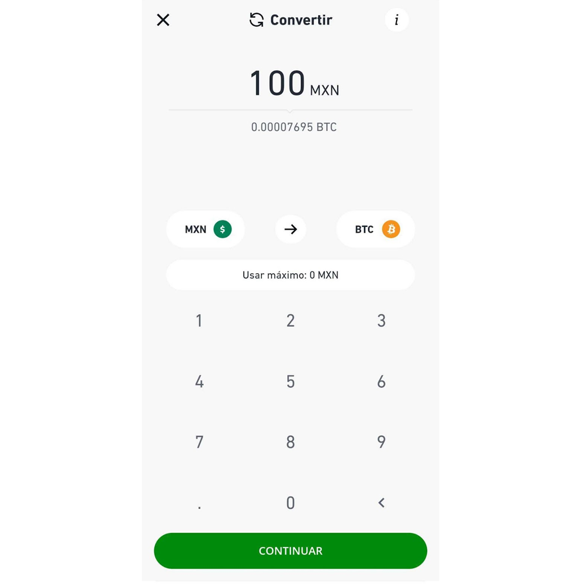
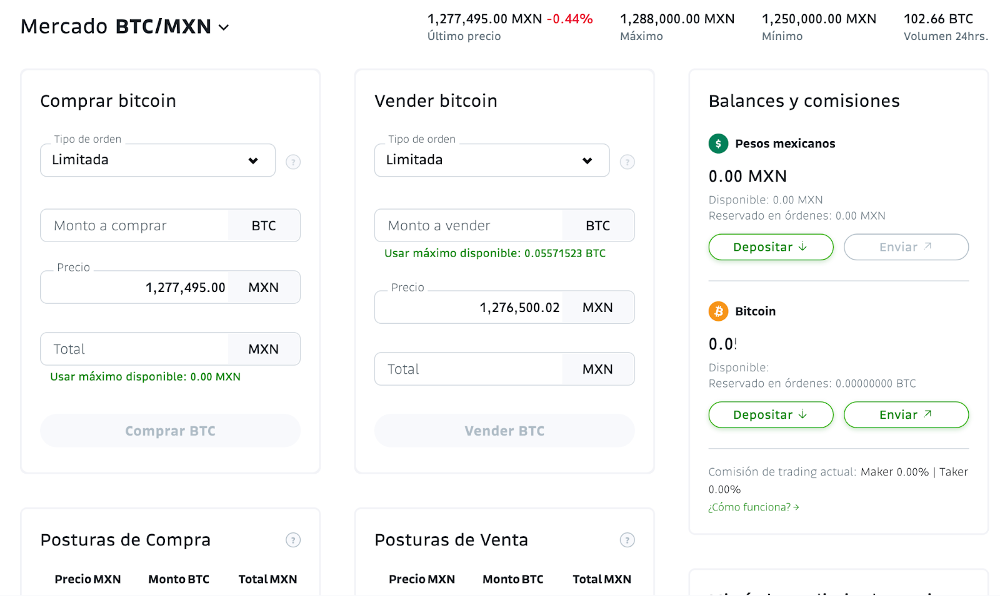
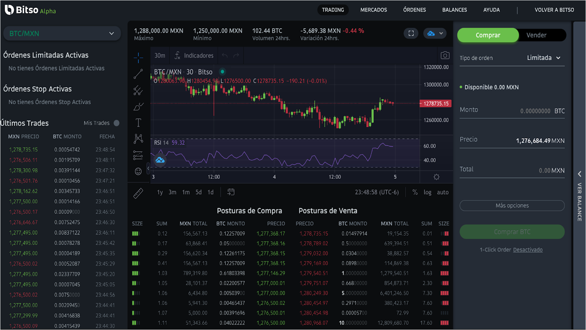

--- 
date: '2021-11-08' 
title: '¿Cómo comprar y vender Bitcoin y criptomonedas en Bitso?' 
image: 'bitcoin.jpg'
imageAlt: 'Representación física de un bitcoin'
tags: ["cripto", "inversión"]
--- 

Bitcoin es una criptomoneda que está revolucionando las finanzas y está abriendo oportunidades de inversión a todo el mundo. La llegada de Bitcoin trajo innovación y nuevas criptomonedas que poco a poco han demostrado ser proyectos escalables y atractivos para invertir.   

## ¿Qué es Bitso?

Es una empresa mexicana que cuenta con una licencia de criptomonedas internacional y su filial Nvio fue la primera empresa en lograr la autorización para operar como Institución de Fondos de Pago Electrónico bajo el marco de la ley para Regular las Instituciones de Tecnología Financiera, o Ley Fintech. Esto fue otorgado por la Comisión Nacional Bancaria y de Valores.   

Esto permite fondear la cuenta con una transferencia interbancaria SPEI además de realizar transferencias de criptomonedas sin costo entre usuarios de Bitso, agregar beneficiarios y depositar dólares con transferencia SWIFT.   

Cuenta con 6 mercados para operar: Pesos mexicanos (MXN), Pesos argentinos (ARS), Reales brasileños (BRL), USD Stablecoins, Bitcoin y DAI.   

Bitso se ha convertido en la segunda empresa mexicana en ser unicornio (empresas que alcanzan o sobrepasan el valor de los 1,000 millones de dólares) con su reciente levantamiento de capital.   

## ¿Cómo crear una cuenta en Bitso?

Requisitos para crear tu cuenta:   
+ Ser mayor de edad
+ Tener INE o pasaporte vigente. 
+ Contar con CURP   

Ingresa a este enlace para crear una cuenta: **[bitso.com](https://www.bitso.com)**   

## Compra y vende Bitcoin y criptomonedas.

Antes de comprar debes fondear tu cuenta, puedes hacerlo mediante una transferencia bancaria SPEI. Puedes empezar a comprar desde $100 MXN.   

Una vez fondeada tu cuenta podrás comprar Bitcoin y otras criptomonedas que se tienen listadas. Podrás hacerlo desde 3 opciones: App, Bitso Classic y Bitso Alpha.   

## Compra desde la app de Bitso.

La app de Bitso está disponible para Android y iOS. En ella podrás usar la opción Convertir para obtener Bitcoin u otras criptomonedas. Solo debes ingresar el monto que deseas convertir de pesos a Bitcoin.   

Esta es la manera más fácil y rápida de obtener Bitcoin y otras criptomonedas.   

  

## Compra desde Bitso Classic
Esta es una plataforma más avanzada en donde encontrarás diferentes tipos de órdenes como Mercado, Limitada y Stop Limit.   

 
  

A diferencia de la app en Classic podrás tener el control del precio al que quieres comprar o vender al usar las órdenes limitadas.   

## Compra desde Alpha Pro

Esta es la plataforma Profesional de Bitso en donde encontrarás herramientas avanzadas para hacer análisis técnico y gráficas de vela. También encontrarás diferentes tipos de órdenes como Mercado, Limitada y Stop Limit.   

 

Alpha Pro también está disponible para Android y iOS.   

Síguenos en nuestras páginas de **[Facebook](https://facebook.com/oasisfinanciero)**, **[LinkedIn](https://www.linkedin.com/company/oasisfinanciero/)** e **[Instagram](https://www.instagram.com/oasis_financiero/)** para más tips de cómo transformar tu vida financiera.