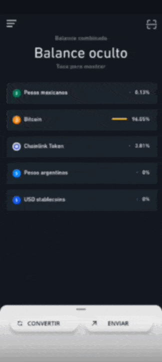
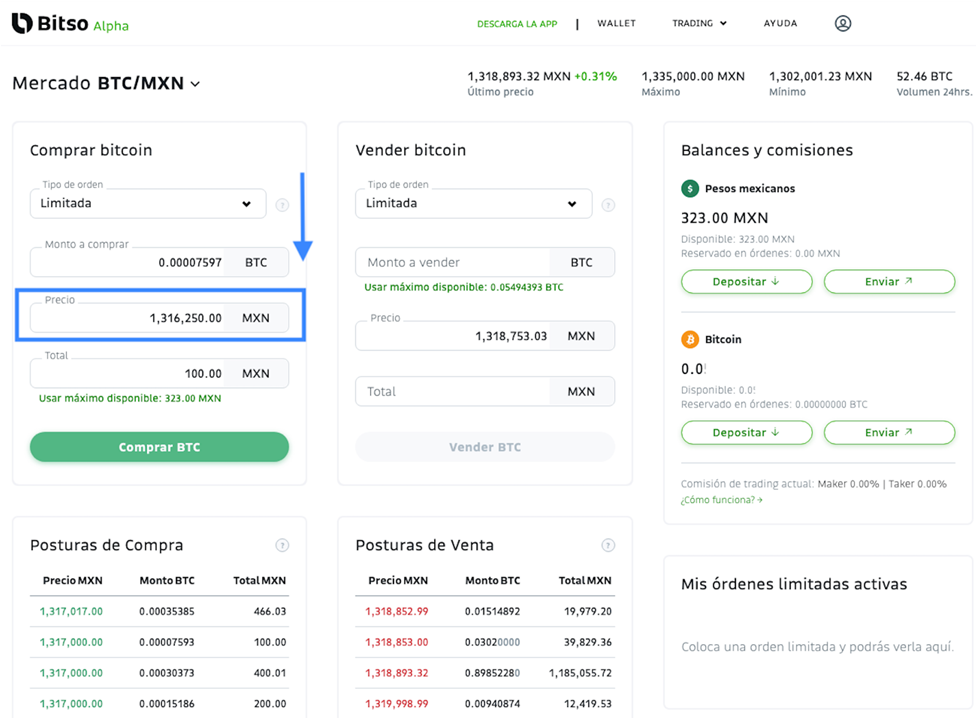

Bitcoin es una criptomoneda que está revolucionando las finanzas y está abriendo oportunidades de inversión a todo el mundo. La llegada de Bitcoin trajo innovación y nuevas criptomonedas que poco a poco han demostrado ser proyectos escalables y atractivos para invertir.   

## ¿Qué es Bitso?

Es una empresa mexicana que cuenta con una licencia de criptomonedas internacional y su filial Nvio fue la primera empresa en lograr la autorización para operar como Institución de Fondos de Pago Electrónico bajo el marco de la ley para Regular las Instituciones de Tecnología Financiera, o Ley Fintech. Esto fue otorgado por la Comisión Nacional Bancaria y de Valores.   

Esto permite fondear la cuenta con una transferencia interbancaria SPEI, realizar transferencias de criptomonedas sin costo entre usuarios de Bitso, agregar beneficiarios y depositar dólares con transferencia SWIFT.   

Cuenta con 6 mercados para operar: Pesos mexicanos (MXN), Pesos argentinos (ARS), Reales brasileños (BRL), USD Stablecoins, Bitcoin y DAI.   

## ¿Cómo crear una cuenta en Bitso?

Requisitos para crear tu cuenta:   
+ Ser mayor de edad
+ Tener INE o pasaporte vigente.
+ Contar con CURP   

**[Haz clic aquí para crear tu cuenta y comenzar a comprar criptomonedas.](https://www.bitso.com)**   

## Compra y vende Bitcoin y criptomonedas

Antes de comprar debes fondear tu cuenta, puedes hacerlo mediante una transferencia bancaria SPEI. Puedes empezar a comprar desde $100 MXN.   

Dentro de tu cuenta da clic en la parte superior izquierda Menú y luego en Deposita en tu cuenta. Te aparecerán los datos que deberás usar para transferir fondos desde tu banco. En tu app bancaria, en el nombre del banco deberás buscar STP (Sistema de transferencias y Pagos) ya que no aparecerá Bitso.   

Una vez fondeada tu cuenta podrás comprar Bitcoin y otras criptomonedas que se tienen listadas. Podrás hacerlo desde 3 opciones: App, Alpha Classic y Alpha Pro.   

## Compra desde la app de Bitso

La app de Bitso está disponible para Android y iOS. En ella podrás usar la opción Convertir para obtener Bitcoin u otras criptomonedas. Solo debes ingresar el monto que deseas convertir de pesos a Bitcoin.   

Esta es la manera más fácil y rápida de obtener Bitcoin y otras criptomonedas.   

  

## Compra desde Alpha Classic
Esta es una plataforma más avanzada en donde encontrarás diferentes tipos de órdenes como Mercado, Limitada y Stop Limit.   

¿Qué diferencia tiene con respecto a la app?   

En la app solo puedes convertir, es decir no tienes el control del precio al que convertirás pesos a criptos y viceversa. En Alpha classic tienes la opción de poner el precio al que quieres comprar o vender usando las órdenes limitadas.   

  

Para acceder solo debes entrar a tu cuenta desde un explorador y dar clic en Trading y luego Alpha Classic.   

## Compra desde Alpha Pro

Esta es la plataforma Profesional de Bitso en donde encontrarás herramientas avanzadas para hacer análisis técnico y gráficas de vela. También encontrarás diferentes tipos de órdenes como Mercado, Limitada y Stop Limit.   

 

Para acceder solo debes entrar a tu cuenta desde un explorador y dar clic en Trading y luego Alpha Pro. También está disponible para Android y iOS.   

**[Haz clic aquí para crear tu cuenta y comenzar a comprar criptomonedas.](https://www.bitso.com)**   

Síguenos en nuestras páginas de **[Facebook](https://facebook.com/oasisfinanciero)**, **[LinkedIn](https://www.linkedin.com/company/oasisfinanciero/)** e **[Instagram](https://www.instagram.com/oasis_financiero/)** para más tips de cómo transformar tu vida financiera.