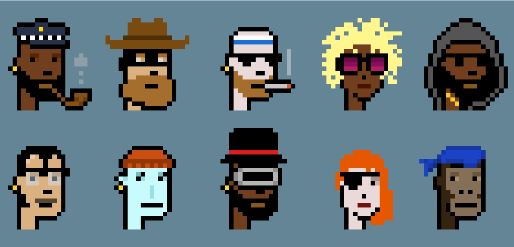
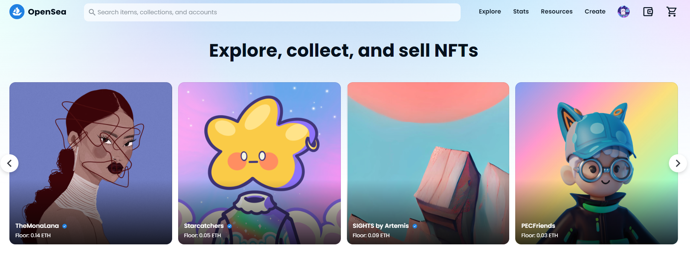
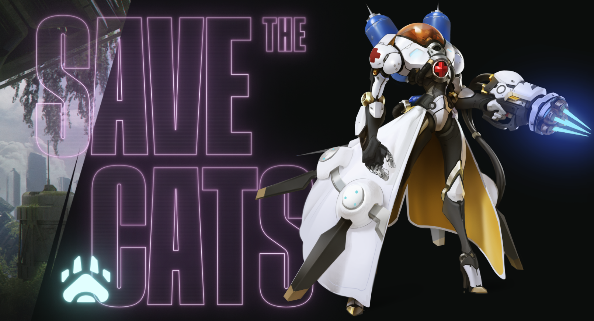

<!--StartFragment-->

NFT por sus siglas en inglés significa Non Fungible Token, token no fungible. Estos son activos digitales que se crean y existen en una blockchain (cadena de bloques) y al mismo tiempo almacenan información que no puede ser manipulada ni duplicada.   

Un Token es un archivo digital dentro de la blockchain por lo que tiene un registro y es traceable. Estos archivos digitales pueden ser imagen, video, audio o modelos 3D.  

Fue en 2012 cuando los primeros NFTs fueron creados, estos fueron los Colored Coins pero fue hasta 2017 donde uno de los proyectos más conocidos en el ecosistema hice su aparición, los Cryptopunks.   

Son 10,000 NFTs de 8 bits con una estética Punk de los años 70s. Cada Cryptopunk tiene características diferentes  con 3 clases diferentes: zombies, simios y aliens.   

  

En 2017 también hicieron su aparición los Cryptokitties. Estos tienen diferentes atributos que los hacen únicos y fueron creados en Ethereum al igual que los Cryptopunks.   

  

El mercado explotó hacia fines de 2020 y principios de 2021 con especial enfoque a los videojuegos ya que es una industria que en 2021 generó 180,300 millones de dólares.   

## Los NFTs en el arte.  

 El artista digital Mike Winkelmann (Beeple) vendió en 69 millones de dólares su denominada “The first 5000 days”. Esta fue un NFT y es un collage compuesto por 5000 piezas de trabajo que el artista había ido creando cada día desde 2007.   

Este es solo un ejemplo de como los NFT estánagrendo valor a las obras de arte ya que artsitas independientes pueden crear una colección a partis de obras que ya tengan desde hace tiempo o crear una colección exclusiva para el mercado NFT.   

Estos NFT pueden ser vendidos en plataformas como Opensea, Magic Eden, Rarible entre otras. Son los artistas quienes deciden el valor por cada NFT creado y estas plataformas permiten que el artista tenga regalías de hasta el 10% por cada reventa.   

Si el artista ya tiene una comunidad en redes sociales y se apoya de la misma, podría tener un gran apoyo y al mismo tiempo podría crecer su comunidad al agregar utilidad a sus NFT. Esta utildad puede ser acceso a nuevas colecciones, eventos exclusivos para coleccionistas de sus obras, airdrops, etc.   

### Otros casos de uso para los NFTs.  

Los NFT están llegando a varias industrias ya que no solo se pueden aprovechar en arte o videojuegos. Gracias a la tecnología blockchain estos pueden ser usados para crear tickets de cines o conciertos, en el sector inmobiliario, identificación digital entre otros.  

#### ***NFTs en los videojuegos***  

La industria de los videojuegos es de las más exitosas desde hace varios años y es en esta donde los NFTs están cambiando las reglas. Esto se está logrando al hacer que los personajes sean NFTs por lo que al ser comprados, el comprador se vuelve dueño del personaje y puede revenderlo o rentarlo.  

  

## ¡Ya disponible! [**Curso online de Introducción a los NFTs** ](https://www.crehana.com/cursos-online-data/introduccion-a-los-nfts-1/?source_page=Catalog&__country_code=mx)

<iframe width="560" height="315" src="https://www.youtube.com/embed/UM_ksFZIrs4" title="YouTube video player" frameborder="0" allow="accelerometer; autoplay; clipboard-write; encrypted-media; gyroscope; picture-in-picture" allowfullscreen></iframe>

## ¿Qué aprenderás en el curso Introducción a los NFTs?

* Comprenderás qué son los NFTs y la diferencia entre fungible y no fungible.
* Harás un repaso sobre la tecnología que se usa para que los NFTs sean únicos.
* Revisarás cuáles son las industrias en donde se están aplicando los NFTs como valor agregado a sus usuarios.
* Analizarás cómo los NFTs pueden ayudar a la propiedad intelectual y cómo evitar estafas en el mercado actual

## **[¡Ingresa aquí para tomar el curso!](https://www.crehana.com/cursos-online-data/introduccion-a-los-nfts-1/?source_page=Catalog&__country_code=mx)**

<!--EndFragment-->