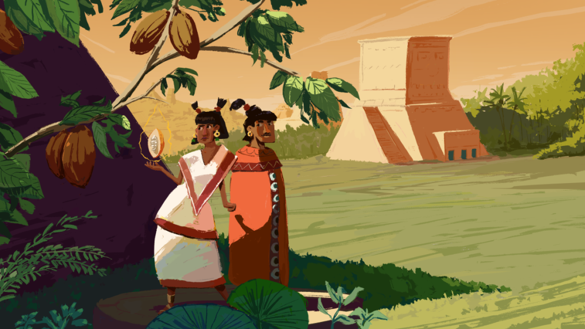

La economía actual ha tenido diversos altibajos los cuáles han afectado la situación financiera de la sociedad en diferentes ámbitos. Durante y después de la pandemia el desempleo y la inflación son de las consecuencias que más están afectando a México y Latinoamérica.  

Es aquí en donde la tecnología blockchain a servido para crear nuevos modelos como las finanzas descentralizadas (DeFi - Decentralized Finance).  

DeFi es un ecosistema financiero construido sobre la tecnología blockchain y es en este donde los propios usuarios son quienes intercambian activos y servicios financieros directamente entre ellos, sin intermediarios y para usarlos como mecanismo de inversión o financiación.  

Es aquí donde surjen proyectos que innovan y ofrecen nuevos modelos financieros como **Xocolatl, el primer protocolo mexicano descentralizado** el cuál tiene su propia stablecoin **XOC** que tiene paridad 1:1 con el peso mexicano.  

***[Entra al siguiente artículo para conocer ¿Qué son las stablecoins?](https://www.oasisfinanciero.mx/blog/2022-10-15/que-son-las-stablecoins/)***  

***Ivan Flores*** es uno de los miembros fundadores de Xocolatl y nos platica un poco sobre el proyecto.  

**¿Que es $XOC?**  

**$XOC** es un token ERC20 viviendo en Polygon. Es una moneda estable en paridad 1:1 al peso MXN al momento de acuñarse. Es la primer moneda estable creada y gobernada por la comunidad en México que necesita un stablecoin legítimo para construir financas decentralizadas justas e inclusivas.  

**¿Cómo surge el proyecto Xocolatl?**  Basado en el exito que ha tenido DeFi hasta hoy con protocolos como Aave, Compound y MakerDAO, nos dimos cuenta que todo empieza con una stablecoin, en ese caso el de DAI, en nuestro caso XOC. Así cualquier hacker o emprendedor tiene un ERC20 con paridad al peso MXN para construir una applicacion decentralizada usando practicamente pesos MXN. Asi surge el protocolo del Xocolatl.   

**¿Porque Xocolatl?** Nuestro intención fue distinguir que hace cientos de años los aztecas y mayas usaban semillas de cacáo como moneda, así XOC es una nueva moneda que mueva a México a un nuevo sistema de finanzas decentralizadas.  

  

**¿Que diferencía a Xoc de otras stablecoins mexicanas?**  XOC es un stablecoin sobre-colaterizado usando Wrapped Ether, nuestra contraparte en Polygon - Jarvis Synthetic Mexican Peso (jMXN) usa USDC para colaterizar su moneda. Hasta ahorita son las unicas dos stablecoins MXN con utilidad en el blockchain. Con XOC puedes comprar o vender por cualquier otro token ERC20, comprar acciones de La DAO y al final del día pagar directamente a cualquier otra persona donde ella puede usar Suarmi para depositar en su banco usando SPEI. Nuestro Roadmap es ser la stablecoin MXN que México identifique como legiítima y segura.  

**¿Cuáles son los objetivos que quieren cumplir con Xoc?**  Los primeros objetivos son crear un DeFi en México donde cualquier persona pueda transicionar a web3, usando XOC para comprar NFTs, prestar en mercados decentralizados y tener suficiente liquidez para experimentar con casos de uso como remesas.  

**¿Cómo y en donde podemos empezar a usar Xoc?**  La manera mas facil de empezar es usando Suarmi para comprar XOC en Polygon, usarios nativos a la web3 pueden comprar XOC en Uniswap o Curve y en enuestro Discord pueden preguntar cualquier duda y unirse al movimiento que estamos construyendo.  

Puedes conocer más sobre Xocolatl en su página web y no olvides seguirlos en sus redes sociales.  

Web: https://xocolatl.club/

Twitter: https://twitter.com/PipilaDAO

LinkedIn: https://www.linkedin.com/company/xocolatl-finance/  

***[Entra al siguiente artículo para saber Que son los NFTs y su valor en el arte y videojuegos](https://www.oasisfinanciero.mx/blog/2022-06-18/qu%C3%A9-son-los-nft-y-su-valor-en-el-arte-y-videojuegos/)***