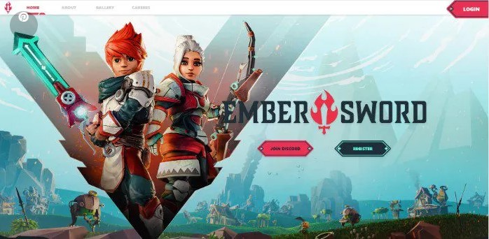
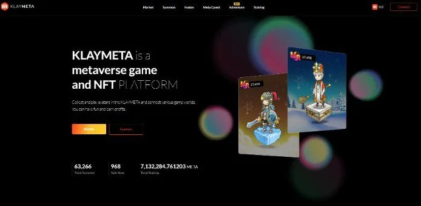
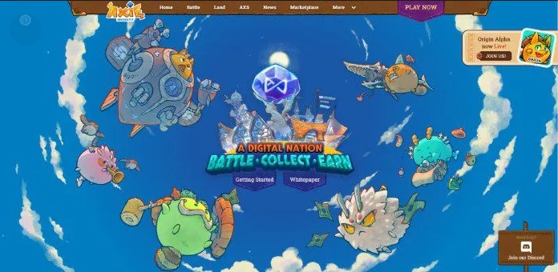
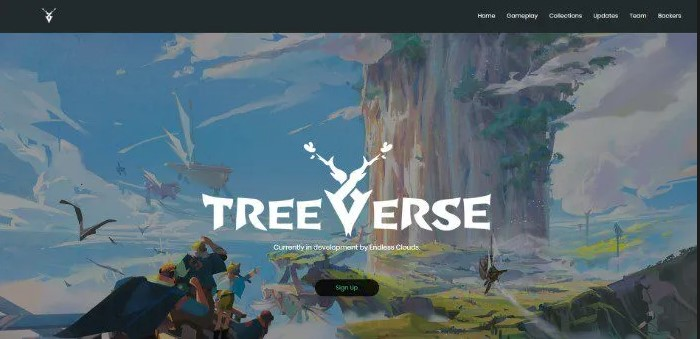
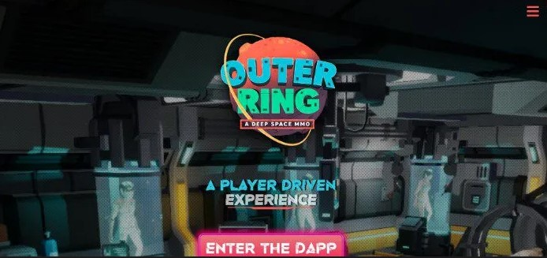

**Los 5 mejores juegos MMORPG Blockchain para 2023.**

Los juegos de rol masivos en línea basados en Blockchain (MMORPG- Massive Multiplayer Online Role Playing Game) son cada vez más populares a medida que las principales compañías de videojuegos continúan moviéndose hacia la Web3.

Una visión rápida:

•	Los juegos Web3 se perciben como el futuro de los juegos en línea.

•	Los fabricantes de videojuegos tradicionales están comenzando a migrar hacia la Web3 a medida que los MMORPG basados en Blockchain ganan popularidad.

•	KlayMeta y Ember Sword son algunos de los MMORPG más interesantes de cara a 2023.

   La evolución de la industria de los videojuegos está a punto de dar paso a una nueva era de juegos. Los desarrolladores de videojuegos están empezando a aceptar que el concepto de juego basado en Blockchain que recompensa a sus usuarios es el futuro.

Por esta razón, las principales empresas de videojuegos están desarrollando versiones Web3 de algunos de sus títulos más emblemáticos, siendo empresas como Square Enix las primeras en el proceso de adopción. 

En este artículo, analizamos algunos de los juegos de rol multijugador masivo en línea (MMORPG) más interesantes de 2023.

La Web3 se describe generalmente como una Internet basada en Blockchain que da prioridad a la descentralización, las comunicaciones “trustless” (1) y las comunidades propiedad de los usuarios. Desde el punto de vista de los juegos MMORPG, los creadores de juegos están aprovechando la tecnología Web3 para alimentar las economías de sus juegos con tokens dentro del juego y tokens no fungibles.

Como resultado, los jugadores pueden beneficiarse más de los juegos a través del mecanismo de juego Play-to-earn (P2E) y el comercio de personajes en el juego en forma de avatares NFT.

1. MMO VS. MMORPG.

Un MMORPG es un tipo de juego de rol en línea en el que varios jugadores interactúan entre sí mediante competiciones y equipos en mundos virtuales. Por otro lado, los MMO (massively multiplayer online) pueden ser de un solo jugador o multijugador. Todo depende del diseño del juego.

Los MMO se centran en el combate y/o las misiones, mientras que los MMORPG se centran en la comunidad y las interacciones sociales, que es también una de las principales características de la Web3. 

Además, los MMORPG ofrecen varias actividades dentro del juego, como comercio, “crafting”(2), exploración y combate jugador contra jugador (PvP) para mantener a los jugadores comprometidos. En otras palabras, un MMORPG ofrece una experiencia de juego más envolvente.

Todos los MMORPG son MMO, pero no todos los MMO son MMORPG.

Sin un orden en particular, aquí están 5 de los mejores MMORPG basados en Blockchain para 2023. Aunque hay varias características similares entre unos y otros, cada uno de ellos ofrece algo distintivo que su comunidad encuentra más entretenido y gratificante en comparación con los demás.

2. Ember Sword (Polygon). 

Ember Sword es un MMORPG basado en Blockchain, creado por Bright Star Studios. El juego ofrece una experiencia de juego muy socializada, impulsada por la comunidad a través de la propiedad de activos digitales como skins y avatares.

Los jugadores pueden poseer, intercambiar y vender activos del juego y ganar cripto-recompensas por completar misiones, participar en actividades del juego y poseer terrenos. Es uno de los primeros juegos basados en Blockchain, cuyo primer tráiler se publicó hace más de cuatro años.

<https://www.youtube.com/watch?v=mrmUZkribyo&t=1s>

Ember Sword también introdujo los NFT como característica cosmética, que complementa el arte y el juego tipo aventuras.

Está basado en el mundo utópico de Thanabus, que contiene cuatro regiones: Duskeron, Ediseau, Sevrend y Solarwood.

3. KLAYMETA (Klaytn).

KLAYMETA es un metaverso play-and-earn, construido sobre la Blockchain Klaytn. Hace hincapié en la creación de juegos divertidos, con la oportunidad de ganar por jugar como una característica adicional, no como su función principal.

La plataforma ha lanzado recientemente sus características iniciales de juego, incluyendo el modo aventura, mientras que el lanzamiento completo está previsto para principios de 2023.

Klaymeta utiliza Blockchain para ofrecer recompensas y NFTs a los jugadores, que pueden ser ganados jugando. También pueden optar por comprar, vender, intercambiar o convertir tokens y activos del juego en tokens de utilidad de $META.

KLAYMETA utiliza su metaverso para llevar los juegos Web3 al mainstream. La plataforma KLAYMETA permite a los desarrolladores más pequeños crear juegos de Blockchain aprovechando su función sin código que permite experimentar con cripto y NFTs.

4. Axie Infinity (Ethereum).

Axie Infinity es un metaverso de juego basado en Blockchain creado por Sky Mavis. Está considerado como la puerta de entrada a los juegos de Blockchain tras inspirar la aparición de los MMORPG de la Web3. El juego de Axie Infinity permite a los jugadores criar, criar, comerciar y luchar contra criaturas fantásticas llamadas Axies. El juego cuenta con una amplia colección de especies únicas de Axies con diferentes apariencias, habilidades y comportamientos.

El juego cuenta con una “economía tokenizada” (3), propiedad total de los usuarios. A través de la cría, Axie permite a los jugadores criar personajes mascota, que luego pueden vender con beneficio en sus diferentes etapas de desarrollo.

<https://www.youtube.com/watch?v=ksoKap3t-gU&feature=emb_logo>

Los jugadores crían Axies utilizando los recursos del juego (SLP y $AXS) que pueden vender a otros jugadores.

El juego afirma tener más de 150.000 usuarios activos mensuales, lo que lo convierte en uno de los juegos NFT más populares. Los jugadores han elogiado a Axie por ofrecer una experiencia de juego casi similar a la de los juegos online tradicionales, un factor no muy común en los juegos de Blockchain. Algunos lo ven más como un juego de Pokemon con características de Play-To-Earn.

5. Treeverse (Ethereum).

Treeverse es un juego social y cooperativo ambientado en un mundo exuberante y místico que presenta hermosos paisajes dominados por los árboles y un combate de ritmo rápido y muy dinámico. 

Este MMORPG centrado en el usuario permite a los jugadores la propiedad de cualquier cosa que adquieran o compren en el juego, incluyendo NFTrees, viviendas y parcelas.

<https://www.youtube.com/watch?v=pA31rxn3hYM&feature=emb_logo>

El juego también cuenta con los coleccionables Treeverse, que son tokens no fungibles (NFT) basados en Ethereum. Los jugadores pueden comprar y vender NFTs de Treeverse cuando lo deseen. El juego debutará como un juego gratuito de jugador contra entorno (PVE) en su lanzamiento antes de lanzar la versión de jugador contra jugador (PVP) en el futuro.

Treeverse está siendo desarrollado por Endless Clouds, un estudio de desarrollo de juegos de Blockchain dirigido por un equipo que ha contribuido a juegos como League of Legends y Rainbow 6 Siege.

6. Outer Ring (BNB).

Outer Ring está ambientado en un vasto universo que combina varios géneros en un MMORPG de disparos en tercera persona. El ecosistema de Outer Ring, estimulado por los jugadores, se está desarrollando con la visión de un metaverso impulsado por el token $GQ. 

El proyecto Outer Ring está gestionado por la comunidad a través del token $GQ y se puede jugar como un “juego freemium” (4) en el que los jugadores pueden acceder y jugar sin comprar NFTs, sólo interactuando con la tecnología tokenizada a voluntad. 

[https://www.youtube.com/watch?v=_jG_xfPTTU0&feature=emb_logo](https://www.youtube.com/watch?v=_jG_xfPTTU0&feature=emb_logo)

Los jugadores que contribuyen al ecosistema son recompensados por el tiempo que invierten y, en consecuencia, dan forma al modelo de economía impulsada por el jugador.

El universo del juego está basado en la Saga del Anillo Exterior, una novela con cinco especies divididas en cuatro facciones que luchan por el control de planetas y recursos.

7. Conclusiones

Los expertos predicen que la industria del juego en la Web3 seguirá experimentando un crecimiento significativo y superará los 200.000 millones de dólares a finales de 2023.

Esto explica el por qué los desarrolladores de videojuegos convencionales están buscando volcarse sobre el mercado de los juegos de Blockchain. Algunos han integrado los NFTs, mientras que otros están lanzando títulos independientes para los jugadores de Blockchain.

**Glosario**

1.Trustless o "Sin Confianza": en el mundo del crypto significa que no es necesario depositar toda la confianza en un solo ente, individuo o institución para que un sistema funcione. Es por eso que cuando dos usuarios realizan una transacción a través de Blockchain, no tienen que depender de un tercero o intermediario que regule el proceso.

2. Crafteo: es un elemento básico en los videojuegos de rol y supervivencia, ya que nos permite crear armas, armaduras, pociones y otros objetos para mejorar nuestras estadísticas.

3. Tokenomics o economía del token: el token sustituye en el entorno digital al dinero fiat o, al menos, se convierte en alternativa válida.

4. Juego Freemium: Es la nomenclatura para un juego que es gratis pero cuyos avances están determinados por el dinero que gastes en él.