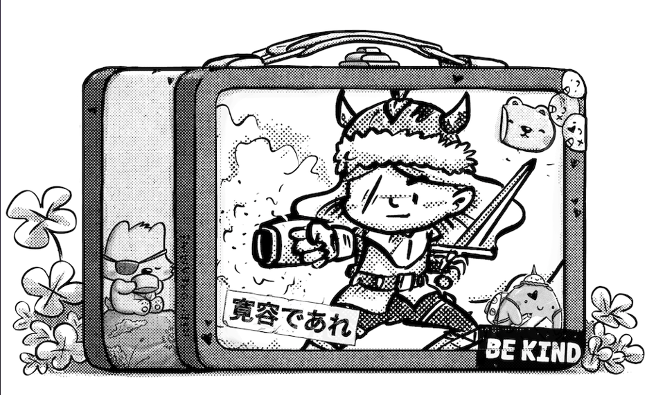

Pablo Stanley fundador de la colección Robotos ha lanzado su nueva colección Humankind.  

Humankind es una colección de 10,000 NFT que nos presenta diferentes personajes como Maya, Dallas, Skipper y Ankka the Hunter. Con estos NFTs se tendrá acceso al mundo Humankind y al mismo tiempo se apoyará a HK Studios.  

> *"Humankind es un proyecto de arte que busca crear historias épicas sobre personajes identificables que nos ayuden a conectarnos con nuestro niño interior. La especie humana es un mundo de monstruos y amigos bien intencionados."*  

Estos nft darán acceso a merchandising, acceso anticipado a nuevos proyectos como Creaturekind, Spiritkind y Monsterkind.  

Esta colección de Lunchboxes ya tiene la venta secundaria en Opensea y estos desbloquearán un Humankind. Estas Lunchboxes tiene distintos diseños los cuáles tendrán que ser quedamos para obtener a un personaje.  

  

## **HUMANKIND FUND**  

Este es un fondo que tiene como objetivo ayudar a los artistas a enfocarse en la creación de su arte ya que se les brindará una renta básica durante un año. Con esto los artistas seleccionados podrán aprender sobre web3 y apoyarse de sus comunidades para llegar a más personas con sus creaciones.  

*¿De dónde viene el dinero?   *

*Estos fondos provendrán inicialmente de un porcentaje de los ingresos obtenidos con el minteo y las ventas secundarias de las colecciones de Humankind.   *

Puedes encontrar toda la información en el siguiente enlace: *https://www.humankind.art/*  

Conoce más sobre NFTs en el siguiente artículo. **[¿Qué son los NFT?](https://www.oasisfinanciero.mx/blog/2022-06-18/qu%C3%A9-son-los-nft-y-su-valor-en-el-arte-y-videojuegos/)**