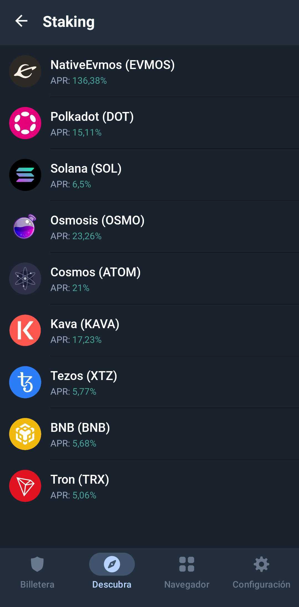
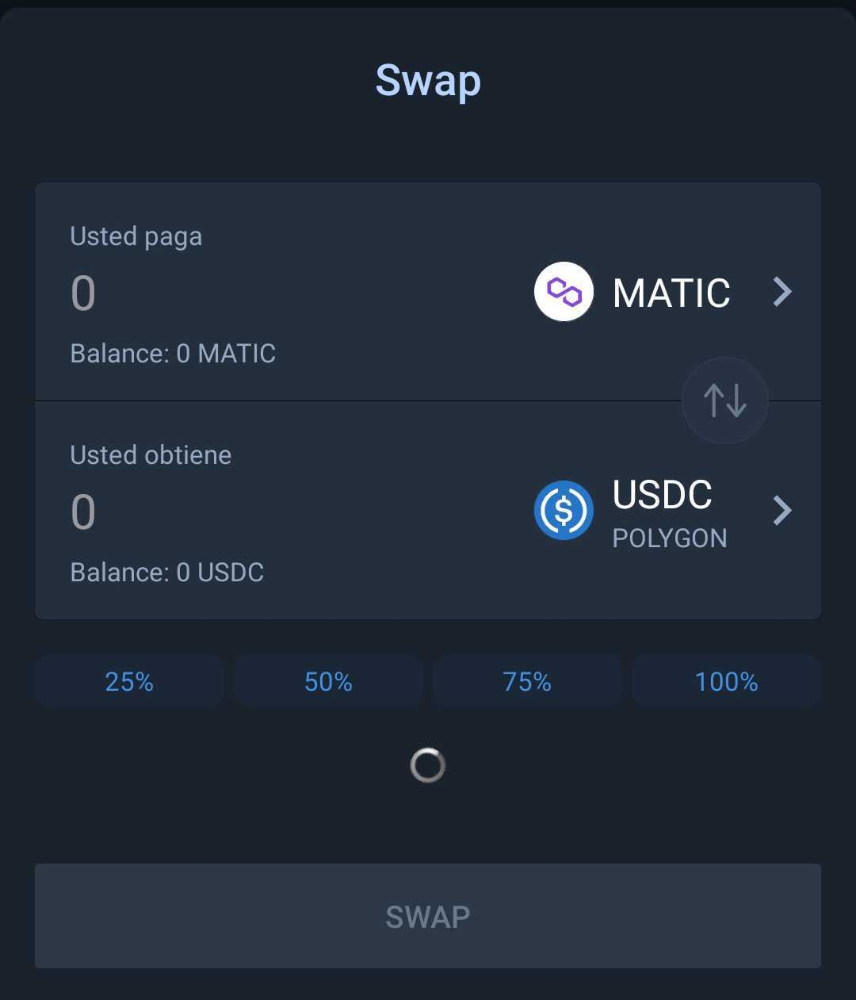
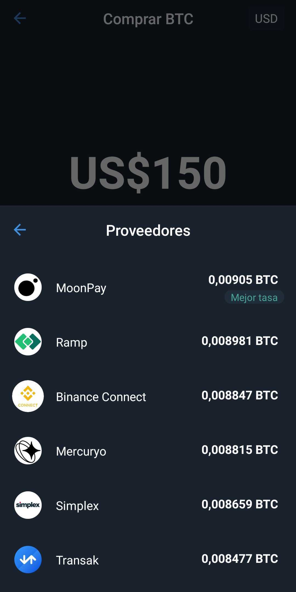

**Trust Wallet** se ha convertido en la cartera descentralizada más descargada en este periodo de incertidumbre y caótica en el mercado de las criptmonedas.  

Las criptomonedas están pasando por uno de los momento más difíciles para el mercado ya que han colapsado varias plataformas en este 2022 como FTX, Terra Luna, Celsius y con esto han provocado un efecto dominó en los precios y otros proyectos.  

En el caso de FTX y Celsius se trataban de plataformas centralizadas en las cuáles se podían guardar las criptomonedas y se tenían servicios como préstamos en stablecoins y con esto generar rendimientos en diferentes criptomonedas. Sin embargo los usuarios no tenían el control sobre sus fondos ya que las carteras que estas plataformas ofrecían eran custodiadas.  

***Una wallet o cartera es donde se almacenan las criptomonedas.***  

### ***Tipos de wallets de criptomonedas:  ***

* **Hot wallet**: Estas carteras son 100% online ypueden ser aplicaciones y también se pueden instalar como extensiones en el navegador.  
* **Cold wallet**: Estas carteras son físicas (hardware) y funcionan sin conexión a internet. Estos\
  dispositivos físicos como una USB, lo que les convierte en la opción más segura.  

Dentro de las Hot wallets están las que ofrecen los exchanges como Bitso o Binance las cuales se vuelven muy convenientes ya que te permiten guardar tus criptos y acceder a varios mercados al mismo tiempo. En el caso de Bitso podrás mandar pesos mexicanos, pesos argentinos, pesos colombianos, reales brasileños y dólares.  

Aunque todo parece muy bien de primera vista, estas carteras custodiadas están 100% manejadas por los exchanges y por ende sujetas a sus reglas y políticas por lo que no eres dueño de las mismas. Si estas plataformas deciden bloquear tu cartera es muy probable que no puedas acceder a tus fondos y perderlos. ***Not your keys, not your coins***  

## Trust Wallet.  

Trust Wallet es una cartera sin custodia que ofrece una amplia variedad de funcionalidades y y compatible con múltiples monedas que ofreciendo acceso a varias cadenas en una única aplicación.   

Los usuarios de Trust Wallet tienen control total sobre su frase semilla, lo que hace que sea una aplicación sin custodia. Adicionalmente se puede navegar en diferentes Dapps dentro de Trust Wallet.  

#### ¿Qué puedes hacer con Trust Wallet?  

**Staking:** Por el momento puedes hacer statking con las siguientes criptomonedas.  

  

**Swap:** Se puede realizar intercambio dentro de la aplicación y son nativos cross-chain.  

  

**Compras:** Los usuarios pueden comprar criptomonedas con fiat mediante seis proveedores. Se pueden comprar más de 40 criptomonedas con tarjeta de crédito o débito incluso con Apple Pay, Google Pay o transferencia bancaria en ciertos países.  

  

Trust Wallet se puede descargar para iOS, Android y ha lanzado la extensión web la cuál ya puedes agregar a diversos navegadores.  

**Trust Wallet es una de varias opciones, sin embargo el diseño que ofrece la hace fácil de usar y entender además de ofrecer dentro de la aplicaciones varias opciones para compra y resguardo.**