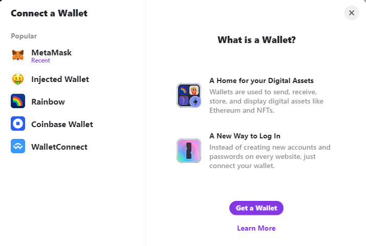
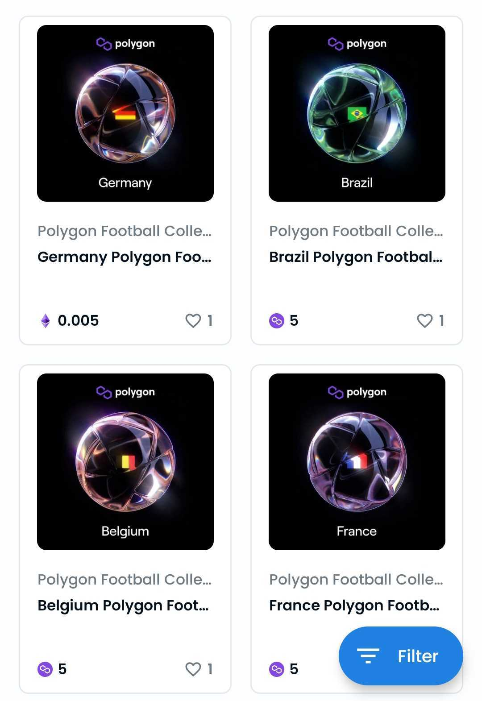
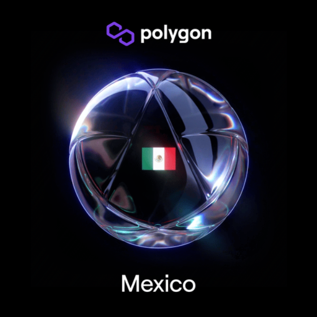

El mundial de Qatar ha comenzado y como cada 4 años hay sorpresas en cada partido pero esta vez la sopresa viene de la tecnología blockchain con Polygon.  

**Polygon** ha lanzado **NFTs** por cada equipo que está participando en el mundial.  

Son 32 equipos participantes y por cada uno hay 10,000 NFTs que puedes mintear completamente gratis. Solo tienes que conectarte con tu cartera y que esta soporte la red Polygon.  

Estas carteras pueden ser Metamask, Rainbow, Coinbase o usar WalletConnect para conectar la cartera de tu preferencia.  

  

Una vez conectado podrás hacer el proceso de minteo y posteriormente te aparecerán los NFTs en tu cartera si esta soporta poder visualizarlos.  

  

Desde la página podrás elegir a la selección de tu preferencia y obtener el NFT.   

  

En este enlace podrás mintear los NFT de tu selección favorita: <https://polygon.technology/football-on-polygon?spdl=e8f3a9bc3>  

## **[Si quieres saber más sobre los NFTs, ingresa a nuestro artículo ¿Qué son los NFT?](https://www.oasisfinanciero.mx/blog/2022-06-18/qu%C3%A9-son-los-nft-y-su-valor-en-el-arte-y-videojuegos/)**   