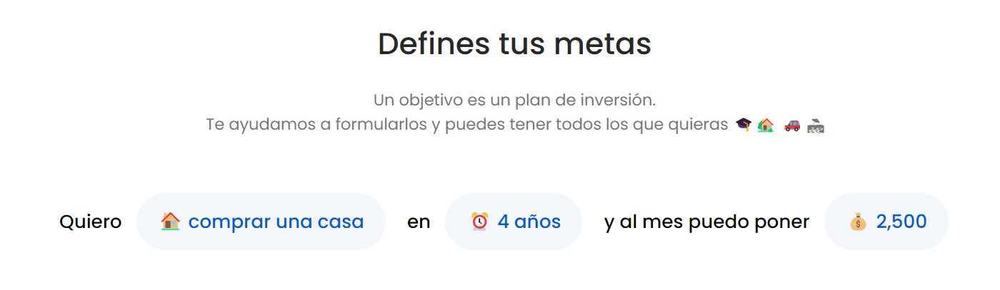
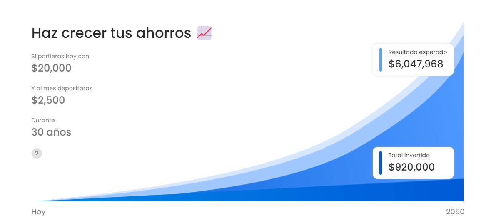

***Fintual*** es una plataforma de inversión que te permite invertir de una manera fácil desde una aplicación o sitio web.  

Se trata de una empresa de origen chileno que tiene operaciones en México desde el 2019. Fintual es una fintech, regulada en México por la Comisión Nacional Bancaria  y de Valores (CNBV).  

Mediante su app o versión web podrás invertir en activos a largo plazo en donde podrás poner tus metas con diferentes esquemas de inversión.  

### **¿Cómo creas un objetivo de inversión?**  

Al crear tu cuenta la plataforma de Fintual empezará con el proceso de construir tu portafolio personalizado dependiendo de tu perfil de riesgo.  

Estos son: **Muy Conservador, Conservador, Moderado y Arriesgado.**  

  

Una vez que se ha creado tu portafolio, deposita directamente desde la app o el sitio web para que tus fondos se inviertan y crezcan en el tiempo estipulado en tu portafolio.  

Tus objetivos pueden ser ahorros para el retiro, comprar una casa, las próximas vacaciones, etc. Además puedes calcular el ahorro necesario para cumplir con tus objetivos a largo plazo.  

  

### **¿En qué invierte Fintual?**  

El modelo es invertir en muchos instrumentos financieros a la vez. De esta forma tus ahorros pueden crecer a largo plazo ya que se invierten en diversas empresas como IBM, Apple, Visa, Microsoft, o fondos ETF (Exchange Traded Funds) que permite la inversión a largo plazo. También se invertirá en deuda del gobierno (Cetes, BPAS y BONDES) y de empresas nacionales.  

### Comienza a crear tu patrimonio en Fintual desde este enlace: **[Comienza a invertir aquí](https://fintual.mx/r/genaroc6)**