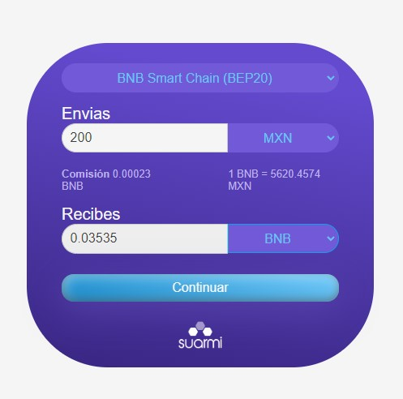

México es el segundo país que más transacciones realiza con criptomonedas solo después de Brasil. Esto se ha demostrado con plataformas de intercambio como Bitso, Binance y TrueBit (antes Mexo) las cuáles han apostado por este mercado.  

Sin embargo aún hay procesos que dificultan la compra de criptomonedas de manera fácil y más directa hacia diversas carteras. Es decir, si tienes una cartera en Metamask, Binance u otras, primero debes enviar pesos a un exchange, comprar tus criptos y luego enviarlos a tu cartera.  

Esto provoca comisiones extras por cada transacción ya que se le paga la comisión al exchange por compra/venta y se paga comisión por los retiros hacia las carteras. Estos últimos son variables y dependen de la cadena blockchain que se ocupa.  

Con esta experiencia es como Roberto y Cuauhtémoc co fundadores de Suarmi se propusieron cambiar la forma en que compramos criptomonedas en México y nos platican al respecto.  

**¿Cómo surge el proyecto Suarmi?  **

Por necesidades propias. Durante nuestro camino de aprendizaje en web3 nos encontramos con buenos proyectos en favor de la innovación. Sin embargo, cuando llegó el momento de conectar con ese mundo mediante moneda fiat de una manera práctica, nos encontramos con que las principales opciones disponibles parecían más bancos que otra cosa y eso no era precísamente lo que necesitabamos, nos cansamos de tener que hacer varios movimientos entre distintas wallets y exchanges para poder lograr lo que realmente queríamos hacer en protocolos web3. Fue entonces que creamos el puente más sencillo que se nos ocurrió entre pesos y cripto, le llamamos suarmi.  

**¿Que diferencía a Suarmi con otras plataformas de intercambio de criptmonedas?   **

La que consideramos las más importante es que no custodiamos tus cripto, nos rige la filosofía de que lo más divertido de web3 está más allá de comprar y vender, en ese sentido no queríamos que fuera una plataforma tradicional (Exchange centralizado con libro de órdenes), lo único que nos tienes que decir es cuánto de qué token quieres comprar (o vender) y nosotros te las mandamos a tu wallet preferida. Por otro lado, debido a como está construido suarmi, nos es posible dar acceso a blockchains y tokens que todavía no son tan famosos pero que pertenecen a proyectos (mexicanos y extranjeros) que nos parecen interesantes. Les damos espacio en nuestro sitio web para que sus usuarios puedan tener acceso fácil a dichos tokens. Para nosotros es importante que el ecosistema vaya creciendo y es por eso que nos gusta hacer eso y no cobramos nada por listar proyectos en suarmi.  

**¿Cuáles han sido los mayores obstáculos que han experimentado?   **

Más que obstaculizarnos, comprender las sutiliezas de lo que implica para nosotros como empresa constituida comprar y vender activos virtuales ha requerido estudio y eso ha tomado tiempo. Afortunadamente hemos conocido en el camino personas muy inteligentes que nos han asesorado desde el principio y qué han hecho el camino más ameno. Conforme más aprendemos de web3, más ganas nos dan de involucrarnos en otros proyectos por lo que mantener el foco también puede volverse algo difícil, sobre todo trabajando en esta industria que está evolucionando constantemente.  

**¿Cuáles son los objetivos que quieren cumplir con Suarmi?   **

Creemos que el cielo es el límite. La revolución de blockchain apenas comienza y nuestra meta es convertirnos en la principal rampa entre fiat y web3 en America Latina. Lo más importante para nosotros es que el ecosistema vaya creciendo. Siempre decimos que si suarmi tiene éxito va a ser porque el ecosistema entero está cambiando como hacemos e interactuamos en internet.**  **

**Actualmente desde Suarmi puedes enviar y recibir en carteras de BSC, Tezos, MATIC/Polygon, Fantom, Avalanche, Algorand y Bitcoin Lightning Network.  **

  

Por si fuera poco, desde Suarmi es posible comprar y enviarte stablecoins como BUSD, USDT,DAI, USDC, jMXN, jEUR y XOC.   

### **[Conoce más en nuestro artículo: ¿Qué son las stablecoins?](https://www.oasisfinanciero.mx/blog/2022-10-15/que-son-las-stablecoins/)**  

Suarmi es un proyecto que sigue en desarrollo y poco a poco va agregando redes blockchain para facilitar la compra, venta y envíos de criptomonedas.  

Puedes seguirlos en sus redes sociales:

[Facebook](https://www.facebook.com/SuarmiExchange), [Twitter](https://twitter.com/0xsuarmi)