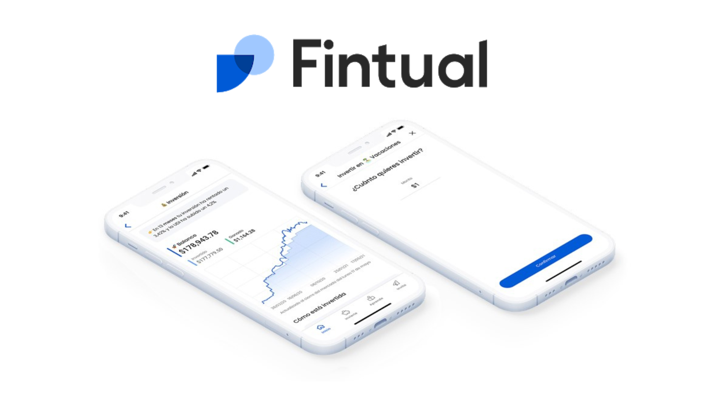

A dos años del inicio de la pandemia, la inflación es una de las principales preocupaciones en la economía mundial. Según el Fondo Monetario Internacional (FMI), la inflación promedio en América Latina será de 7,1% en el 2023.  

Tan solo en este 2022, la inflación Argentina ha sido por 88%, mientras que en México ha alcanzado el 8.41%. Otras dos grandes economías en el continente americano están situaciones similares con Estados Unidos con 7.7% y Brasil con 6.47%.  

**¿Qué es la inflación?**  

Los precios de los bienes y servicios están sujetos a cambios, algunos aumentan y otros disminuyen. La inflación se produce cuando aumentan los precios en general, que da como resultado que con cada peso o dólar puedan adquirirse menos bienes o servicios cada día. Esro quiere decir que la inflación reduce el valor de la moneda de cada país.  

**¿Cómo combatir la inflación?**  

Los expertos tienen varias recomendaciones para proteger tus finanzas ante la inflación. Aquí te presento algunas:  

**Elabora un presupuesto**. Ten en cuenta tus ingresos contra la suma de tus gastos totales ya que esto te dará mayor control de tus finanzas. Es importante priorizar cuáles son los gastos esenciales y cuáles  gastos puedes dejar a un lado.  

**Recorta gastos hormiga.** Aprovecha lo visto en el punto anterior e identifica los gastos hormiga. Son esos gastos que son pequeños pero recurrentes.   

Estos son algunos ejemplos:  

**Cafés.** Tal vez no lo creas pero comprarte cafés de Starbucks o Cielito lindo pueden ser uno de los mayores gastos hormiga si tomamos en cuenta el costo promedio rondando los $85 pesos y una compra habitual de 4 cafés a la semana.   

85x4(días)=340 a la semana

340x4(semanas)=1,360 al mes

1360x12(meses)=16,320 al año  

**Membresías.** Es recomendable cancelar membresías que te ofrecen el mismo servicio. Por ejemplo tener Netflix, Disney plus, HBO, Amazon video. Todas te ofrecen el mismo servicio.  

Membresías de entrega como Rappi, Didi food, Uber Eats te ofrecen el mismo servicio, si pagas más de una membresía es recomendable solo usar una o simplemente salir por la comida al super mercado o pedir directamente a la tienda ya que estos servicios pueden ser gratuitos.  

**Pagar deudas.** Una de las principales causas de estrés financiero es no pagar las deudas cuando se tiene la oportunidad. A fin de año es cuando se suelen recibir bonos en los trabajos y es aquí donde se podría pagar una deuda total o parcialmente.   

**Busca otras fuentes de ingresos**. Esta es una opción que puedes explorar si tienes habilidades que puedes enseñar en clases, talleres o cursos ya sean en persona o pre grabados y ponerlos a la venta en diferentes plataformas. Además podrías buscar empleos freelance donde podrás cobrar por proyecto o tiempo parcial.  

Hacer un uso responsable e inteligente de la Tarjeta de Crédito. Si bien la Tarjeta de Crédito es un instrumento financiero de gran ayuda, se aconseja –especialmente en períodos de inflación- utilizarla para artículos importantes, no para “gustos superfluos”.

### **Comienza a crear tu patrimonio en Fintual desde este enlace: [Comienza a invertir aquí](https://fintual.mx/r/genaroc6)**  

Una vez que se ha creado tu portafolio, deposita directamente desde la app o el sitio web para que tus fondos se inviertan y crezcan en el tiempo estipulado en tu portafolio. **Puedes empezar a invertir desde $1 peso.**  

  

Conoce más sobre Fintual y como empezar hacer crecer tus ahorros con nuestro artículo:   

## **[¿Qué es Fintual y cómo te ayuda a invertir de manera fácil?](https://www.oasisfinanciero.mx/blog/2022-11-30/que-es-fintual-y-como-te-ayuda-a-invertir-de-manera-facil/)**

<!--EndFragment-->