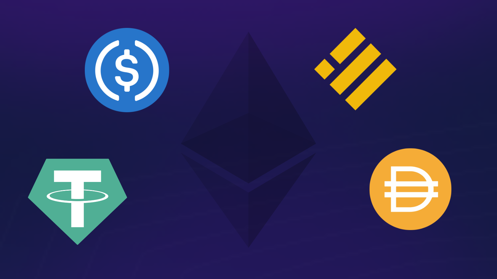

Las finanzas descentralizadas, también conocidas como DeFi, son un conjunto de tecnologías y plataformas basadas en la cadena de bloques que permiten a las personas realizar operaciones financieras de manera descentralizada, es decir, sin la necesidad de intermediarios financieros tradicionales como bancos o entidades financieras centralizadas.   

Esto se logra mediante el uso de contratos inteligentes y otras tecnologías basadas en blockchain que permiten que las operaciones financieras se lleven a cabo de manera segura, transparente y descentralizada.   

En general buscan ofrecer a las personas un mayor control sobre sus finanzas y un acceso más amplio a servicios financieros en comparación con los sistemas financieros tradicionales.  

### **¿Cómo puedo empezar a utilizar las finanzas descentralizadas?  **

Si quieres empezar a utilizar las finanzas descentralizadas, lo primero que tendrás que hacer es obtener una cartera digital o monedero que te permita almacenar criptomonedas. Existen diferentes tipos de carteras digitales disponibles, así que asegúrate de investigar y elegir una que se ajuste a tus necesidades.   

Una vez que tengas tu cartera, podrás empezar a adquirir criptomonedas y utilizarlas para participar en las diferentes plataformas de finanzas descentralizadas.  

### **¿Qué tipo de criptomonedas puedo usar en las finanzas descentralizadas?  **

Las criptomonedas son un tipo de moneda digital que se puede usar en las finanzas descentralizadas. Algunas de las criptomonedas más populares que se pueden usar en las finanzas descentralizadas incluyen Bitcoin, Ethereum, Litecoin, Solana, BNB o stablecoins como USDC, USDT o DAI.

Estas criptomonedas se pueden usar para realizar pagos, intercambiar bienes y servicios y como una forma de inversión.  

### **¿Cuáles son las operaciones que puedo hacer en las finanzas descentralizadas?  **

Algunas de las operaciones que se pueden realizar en las finanzas descentralizadas incluyen:  

* Intercambio de criptomonedas: las finanzas descentralizadas permiten a los usuarios intercambiar criptomonedas entre sí de manera rápida y segura.  
* Préstamos: las plataformas de finanzas descentralizadas también permiten a los usuarios prestar y pedir prestado dinero en criptomonedas, lo que puede ser una forma rentable de obtener ganancias.  
* Inversión: las finanzas descentralizadas también ofrecen la posibilidad de invertir en diferentes proyectos y activos digitales, como criptomonedas, tokens y otros activos digitales.  
* Pago de servicios: las finanzas descentralizadas también permiten a los usuarios pagar por servicios y bienes usando criptomonedas, lo que puede ser una forma más rápida y segura de realizar pagos en línea.  

En resumen, las finanzas descentralizadas ofrecen una amplia gama de operaciones financieras que pueden ser útiles para diferentes usuarios y propósitos.  

Te recomendamos:  

## **[¿Qué son las stablecoins?](https://www.oasisfinanciero.mx/blog/2022-10-15/que-son-las-stablecoins/)**

