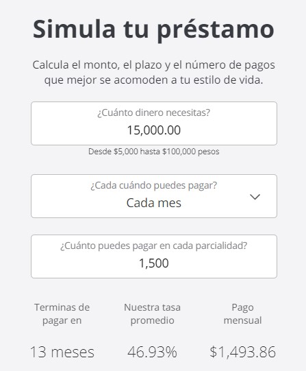

### ¿Qué es Kubo Financiero?  

**Kubo Financiero** es una plataforma que ofrece préstamos personales y está regulada por la Comisión Nacional Bancaria y de valores (CNBV) y por la Comisión Nacional para la Protección y Defensa de los usuarios de Servicios Financieros (CONDUSEF).  

Ofrece préstamos personales en línea que van de los 5 mil a los 100 mil pesos. Los pagos pueden realizarse semanal, catorcenal, quincenal, o mensualmente y los plazos van como mínimo de 4 meses a máximo 36 meses. Sus tasas de interés van desde el 16.40% hasta 70.40%.  

Está cumpliendo 10 años de operación, ha realizado más de 85 mil transacciones que representan más de 3 mil millones de pesos en préstamos.  

### **¿Cuáles son sus ventajas?**  

La tasa de 16.40% de Kubo Financiero es de las más competitivas entre las plataformas que otorgan préstamos. Al tener un buen historial crediticio te beneficiará en las tasas de Kubo.  

Pre aprobación en 5 minutos y tu préstamos en 24 horas hábiles. Una vez aprobado y con los contratos firmados, recibirás el préstamo.  

Sin aval ni garantías. No te solicitarán dinero por adelantado, avales ni garantías de por medio para proceder con el trámite.  

Trámite en línea 100% en línea por lo que no tienes que salir de casa o hacer filas en sucursales.  

**Plataforma regulada y supervisada.** Kubo Financiero está regulada por la Comisión Nacional Bancaria y de Valores (CNBV) y por la Comisión Nacional para la Protección y Defensa de los Usuarios de Servicios Financieros (Condusef).  

## **[Comienza tu registro haciendo clic aquí](http://tracking.credy.eu/aff_c?offer_id=1106&aff_id=3802)**  

Únicamente necesitas tu correo electrónico y la contraseña que tú elijas.  

Este es un ejemplo obtenido directamente en la página de Kubo Financiero en Diciembre 2022.  

Para simular tu préstamo **[da clic aquí](http://tracking.credy.eu/aff_c?offer_id=1106&aff_id=3802)**  

  