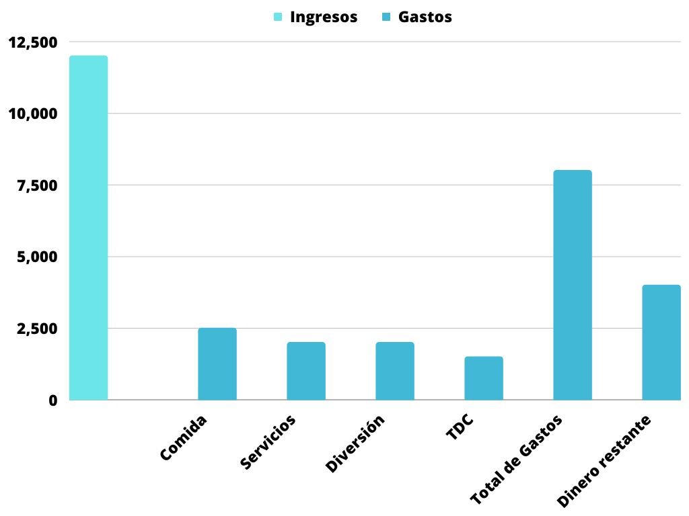
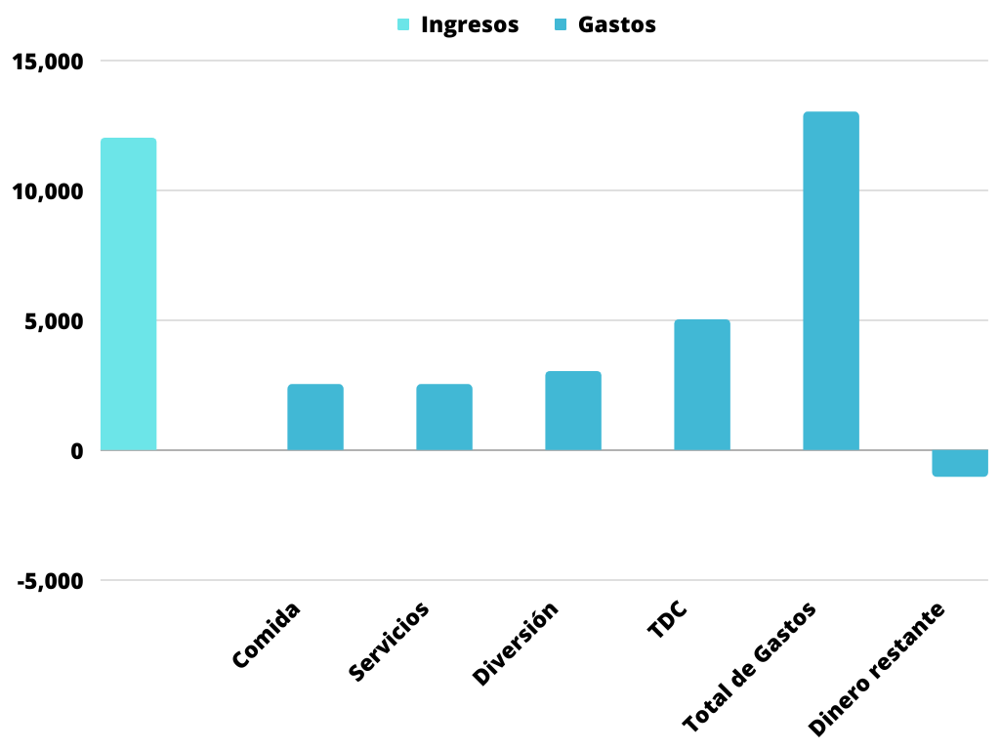

Para crear un presupuesto de gastos e ingresos, puedes seguir los siguientes pasos:  

1. Haz una lista de tus ingresos mensuales: Esto incluye tu salario, cualquier otro trabajo que hagas y cualquier otra fuente de ingresos, como el alquiler de una propiedad o una pensión. Asegúrate de incluir cualquier cantidad que recibas regularmente.  
2. Haz una lista de tus gastos mensuales: Incluye todo lo que gastas en un mes normal, como el alquiler o la hipoteca, el gas, la electricidad, el agua, la comida, el transporte y cualquier otro gasto fijo o variable. También debes incluir cualquier deuda que tengas, como tarjetas de crédito o préstamos, y cualquier otro pago que hagas regularmente.  
3. Resta tus gastos de tus ingresos: Esto te dará una idea de cuánto dinero te queda después de pagar tus gastos. Si tienes más dinero disponible de lo que esperabas, puedes considerar ahorrar parte de él o invertirlo de alguna manera. Si tienes menos dinero de lo que esperabas, debes revisar tus gastos y ver si hay algo que puedas cortar o reducir para ahorrar dinero.  
4. Haz ajustes a tu presupuesto: Si encuentras que tienes menos dinero disponible de lo que te gustaría después de hacer tus cálculos, debes hacer ajustes a tu presupuesto para ahorrar más dinero. Esto puede incluir reducir tus gastos, aumentar tus ingresos o ambas cosas.  
5. Sigue tu presupuesto: Una vez que hayas creado tu presupuesto, es importante seguirlo de cerca para asegurarte de que no te desvíes de tu plan. Esto puede incluir revisar tus cuentas y registros financieros regularmente para asegurarte de que estás gastando y ahorrando de acuerdo a tu presupuesto.  

Este es un ejemplo de como puedes crear una tabla de presupuesto tomando como ingresos 12,000 pesos mensuales y logrando tener dinero disponible al final del mes. Los datos son los siguientes:  

|                            |        |
| -------------------------- | ------ |
| Ingresos mensuales         | 12,000 |
| Gastos en comida           | 2,500  |
| Gastos en servicios        | 2,000  |
| Gastos en diversión        | 2,000  |
| Pago de tarjeta de crédito | 1,500  |
| Total de gastos            | 8,000  |
| Dinero restante            | 4,000  |

  

  

En este otro ejemplo se tiene el mismo ejemplo de ingresos pero con mayores gastos cada mes en donde se muestra que al final del mes quedamos con números rojos, es decir que estamos gastando más de lo que se gana al mes.  

<!--StartFragment-->

|                            |        |
| -------------------------- | ------ |
| Ingresos mensuales         | 12,000 |
| Gastos en comida           | 2,500  |
| Gastos en servicios        | 2,500  |
| Gastos en diversión        | 3,000  |
| Pago de tarjeta de crédito | 5,000  |
| Total de gastos            | 13,000 |
| Dinero restante            | \-1000 |

  

  

Que puedo hacer si tengo más gastos que ingresos?  

Si tienes más gastos que ingresos, es importante tomar medidas para equilibrar tu presupuesto y asegurarte de que tienes suficiente dinero para cubrir tus necesidades básicas y tus deudas. Algunas posibles soluciones incluyen:  

1. Reducir tus gastos: Revisa tus gastos y busca formas de reducirlos. Esto puede incluir cosas como cortar servicios innecesarios, buscar ofertas en tus compras, cocinar en casa en lugar de salir a comer y encontrar maneras de ahorrar en tu factura de energía.  
2. Aumentar tus ingresos: Si tienes espacio para aumentar tus ingresos, considera buscar un trabajo adicional o un trabajo en el que puedas ganar más dinero. También puedes considerar hacer trabajos temporales o freelance para obtener un ingreso adicional.  
3. Priorizar tus pagos: Si tienes deudas, debes asegurarte de que tus pagos más importantes, como el alquiler o la hipoteca, estén al día. Si tienes problemas para paar tus deudas, habla con tus acreedores y trabaja con ellos para llegar a un acuerdo sobre tus pagos.  
4. Obtener ayuda financiera: Si tienes problemas para equilibrar tus ingresos y tus gastos, puedes considerar obtener ayuda financiera. Esto puede incluir cosas como programas gubernamentales de asistencia económica o consejería financiera.  

Es importante recordar que es normal tener problemas financieros de vez en cuando, pero lo importante es tomar medidas para resolverlos y evitar que se conviertan en un problema mayor a largo plazo.  

  