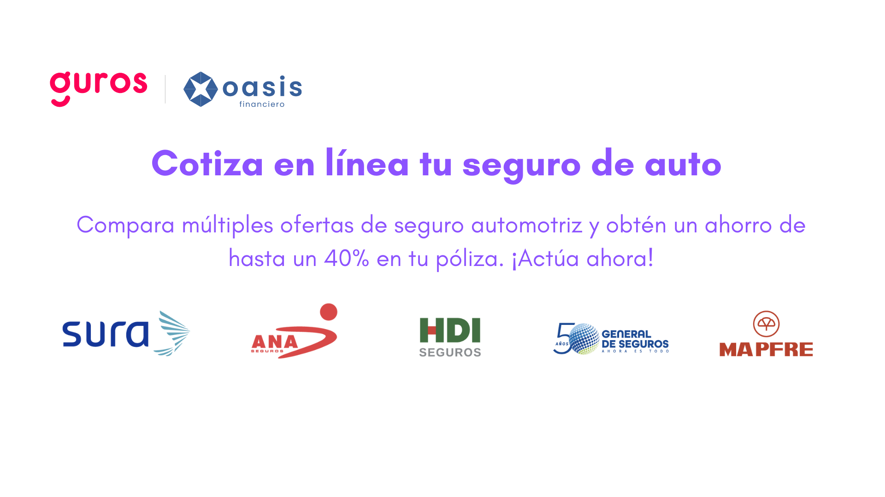

# **Importancia del Seguro de Auto para Proteger tu Inversión.  **

La adquisición de un automóvil representa una inversión importante que necesita estar respaldada por una protección adecuada para asegurar tu patrimonio. Un seguro de auto es fundamental para proteger tu inversión y garantizar la tranquilidad de tus finanzas personales. Aquí te presentamos información relevante sobre la importancia de contratar un seguro de auto y cómo puedes proteger tu patrimonio.  

## **Protección Financiera Integral con los Seguros de Auto.  **

En primer lugar, los seguros de auto ofrecen una protección financiera sólida ante situaciones como accidentes, robos, actos de vandalismo y otros eventos que puedan afectar la integridad de tu vehículo. Tales incidentes pueden derivar en costos significativos y, en muchos casos, conllevar daños a terceros que desencadenen en demandas legales y compensaciones financieras elevadas. Un seguro de auto adecuado se convierte en una defensa ante estos costos y minimiza el impacto en tus finanzas personales.  

## **Protección Personal y de Pasajeros en Caso de Lesiones.  **

Los seguros de auto no solo salvaguardan tu vehículo, sino que también brindan protección adicional para ti y tus acompañantes en el caso de lesiones o daños a la salud. Un seguro de auto es capaz de cubrir gastos médicos y hospitalarios, así como la pérdida de ingresos derivada de lesiones que te impidan trabajar. Además, en ciertos escenarios, el seguro puede proporcionar un transporte alternativo mientras tu vehículo está en reparación.  

<!--StartFragment-->

### **Ventajas de Cotizar con Guros y Oasis Financiero.**

Una ventaja adicional de asegurar tu vehículo es la posibilidad de cotizar diversos seguros con Guros y Oasis Financiero. Esta plataforma te permite comparar y obtener cotizaciones para varios tipos de seguros, incluyendo seguros especiales para autos en **Uber/Didi**, **motos**, **pickups de carga**, **camiones de 3.5 toneladas** y **transportes turísticos y de personal.** Esta variedad de opciones te permite encontrar el seguro que mejor se adapte a tus necesidades y preferencias.  

<!--EndFragment-->

## **[¡Cotiza en línea tu seguro de auto aquí!](https://bit.ly/3QB41vF)**  

  

### **5 Consideraciones Clave al Elegir tu Seguro de Auto.  **

1. **Cobertura: La clave está en la cobertura  **

Es esencial asegurarte de que el plan de seguro que elijas cubra todas tus necesidades. Cada compañía de seguros presenta diversas opciones de cobertura, por lo que es imperativo informarte sobre las inclusiones y exclusiones de cada plan.  

2. **Precio: Balancear el costo y los beneficios  **

El costo del seguro juega un papel determinante. Es importante que el precio sea acorde a tu presupuesto y no sobrepase tus posibilidades. No obstante, no dejes que el precio sea el único factor en tu elección.  

3. **Reputación de la compañía: Confía en la experiencia  **

Selecciona una compañía de seguros con renombre y experiencia en el mercado. Investiga sobre su historial de reclamaciones, su calidad de atención al cliente y su reputación. La mejor elección es una compañía con comentarios positivos y una sólida reputación.  

4. **Descuentos y Ofertas: Ahorro significativo  **

Busca compañías de seguros que ofrezcan descuentos y promociones especiales, como recompensas por buen historial de manejo, descuentos para estudiantes o paquetes de seguros combinados. Estas ofertas pueden contribuir a ahorrar en tus primas de seguro.  

5. **Comparación de Seguros: Toma una decisión informada  **

Es vital comparar diferentes opciones de seguros antes de tomar una decisión. Al comparar planes de seguro distintos, podrás identificar diferencias en cobertura y precio, lo que te permitirá seleccionar el plan más apropiado para tus necesidades y presupuesto. Esta comparativa puede resultar en un ahorro significativo y una protección mejorada para tu vehículo.  

**Conclusión: Protección Valiosa para tu Vehículo y Finanzas  **

En resumen, optar por un seguro de auto representa una elección inteligente y responsable para salvaguardar tu inversión vehicular y tu estabilidad financiera. Asegúrate de elegir un plan de seguro que se ajuste a tus necesidades y presupuesto. Recuerda siempre que la protección de tu vehículo y tus finanzas personales es invaluable. <br

## **¡[Cotiza en línea tu seguro de auto aquí!](https://bit.ly/3QB41vF)**

