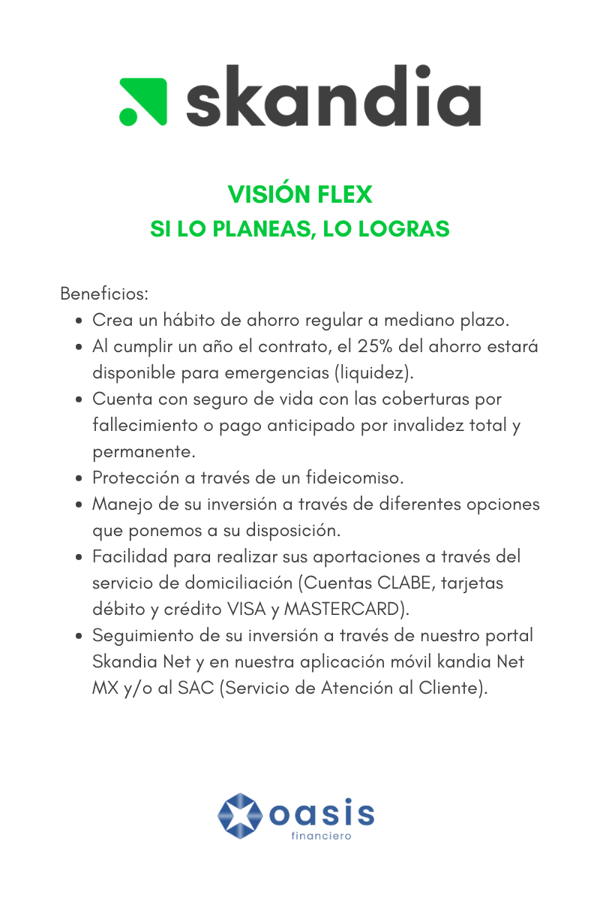
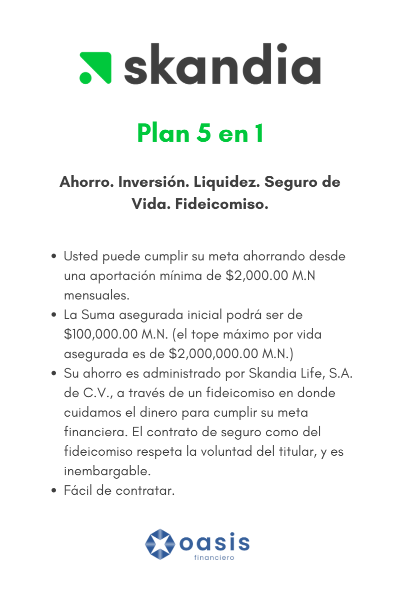
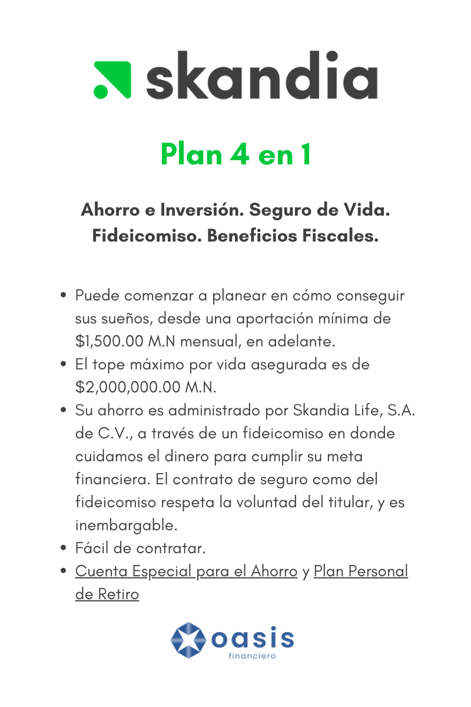

<!--StartFragment-->

La falta de hábito de ahorro es una situación común en la sociedad actual, y puede tener consecuencias significativas en la economía personal y familiar. Muchas personas enfrentan dificultades para afrontar imprevistos y emergencias financieras debido a la falta de un colchón financiero sólido. Sin embargo, el ahorro juega un papel fundamental en la creación de estabilidad y seguridad económica a largo plazo.  

Ahorrar dinero regularmente permite a las personas construir un fondo de emergencia que les brinda tranquilidad y protección en caso de situaciones inesperadas. Contar con ahorros puede marcar la diferencia entre afrontar una emergencia de manera efectiva o caer en dificultades financieras que afectan la calidad de vida.  

Skandia México reconoce la importancia del ahorro y ha desarrollado planes como Visión Flex y CREA para fomentar este hábito y ayudar a las personas a construir un futuro financiero sólido. Estos planes ofrecen una combinación única de beneficios, como la posibilidad de contar con un fondo de emergencia, ahorrar para metas específicas y acceder a protección financiera a través de seguros de vida.  

## **¿Qué es Skandia?**  

Skandia México es una empresa con más de 65 años de experiencia en el país, comprometida en empoderar a las personas para construir un futuro financiero sólido. Con un enfoque en la creación de planes financieros personalizados, Skandia asesora a sus clientes en cómo invertir, ahorrar y protegerse, brindando soluciones integrales adaptadas a sus necesidades.   

Respaldada por un holding financiero internacional sólido, cuenta con un equipo de expertos en administración de inversiones y ha obtenido reconocimientos como la certificación Top Employer y calificaciones destacadas de calificadoras como Fitch Ratings y CityWire.  

### **Visión Flex: Si lo planeas, lo logras.**  

Visión Flex es un plan de ahorro que reconoce la importancia de estar preparado para imprevistos y emergencias. Con un enfoque en la flexibilidad, este plan permite a los millennials construir un fondo de emergencia mientras ahorran para sus sueños y proyectos de vida.   

Después de un año de contrato, el 25% del ahorro acumulado está disponible para enfrentar cualquier imprevisto. Esto brinda a los millennials la tranquilidad de contar con liquidez cuando más la necesiten, sin tener que comprometer sus metas financieras a largo plazo.  

  

  

### **CREA: El inicio de algo maravilloso.**  

Por otro lado, CREA es el plan ideal para aquellos que tienen metas financieras claras y desean comenzar a formar un capital a través del ahorro. Este plan brinda la oportunidad de ahorrar cantidades accesibles de manera regular, con el acompañamiento de expertos financieros de Skandia.   

Ya sea que deseen financiar la educación universitaria, adquirir una vivienda, emprender un negocio propio o planificar su retiro, CREA ofrece una solución integral que combina ahorro, inversión, protección y beneficios fiscales. Además, puedes realizar tus aportaciones de manera sencilla a través de diferentes métodos de pago y tienen acceso a herramientas digitales para dar seguimiento a su inversión.  

  

  

***Ambos planes incluyen un seguro de vida que proporciona cobertura en caso de fallecimiento o invalidez total y permanente.*** Esta protección adicional brinda tranquilidad, asegurando que sus metas financieras estén protegidas en caso de circunstancias imprevistas.  

Además, Skandia administra los fondos acumulados a través de fideicomisos, lo que garantiza que el dinero se destine exclusivamente a cumplir las metas financieras establecidas por los clientes. Esto brinda transparencia y confianza en el manejo de los recursos. ***Ambos planes también ofrecen facilidades de contratación y opciones de manejo de inversión, lo que permite adaptar los planes a sus necesidades y preferencias individuales.***  

Visión Flex y CREA son dos planes de ahorro que están diseñados para ayudarte a construir un futuro financiero sólido. Visión Flex ofrece la flexibilidad de tener un fondo de emergencia mientras se persiguen los sueños, mientras que CREA brinda una solución integral para alcanzar metas financieras específicas. ***Ambos planes ofrecen protección, beneficios fiscales y facilidades de contratación y manejo de inversión***.  

<!--StartFragment-->

**¡No esperes más y comienza a construir tu futuro financiero!** 

Te invitamos a contactar a uno de nuestros asesores expertos. Ellos estarán encantados de brindarte toda la información que necesitas y guiarte en el proceso de contratación.  

#### Haz clic en el siguiente enlace para acceder a nuestro formulario de contacto y solicitar una asesoría personalizada:  

### **[Enlace al formulario de contacto](https://docs.google.com/forms/d/e/1FAIpQLSev-GJI8NVfKd_wN65mKoWWtLePumYbSNYj3mIGzbSsLA3uxA/viewform?usp=sf_link).**  

Nuestros asesores te brindarán una atención personalizada y te ayudarán a seleccionar el plan de ahorro que mejor se adapte a tus necesidades y metas financieras.   

Recuerda, el momento de comenzar a ahorrar es ahora. Haz clic en el enlace y da el primer paso hacia una vida financiera segura y próspera. ¡Te esperamos para acompañarte en esta emocionante travesía hacia el éxito financiero!  

<!--EndFragment-->