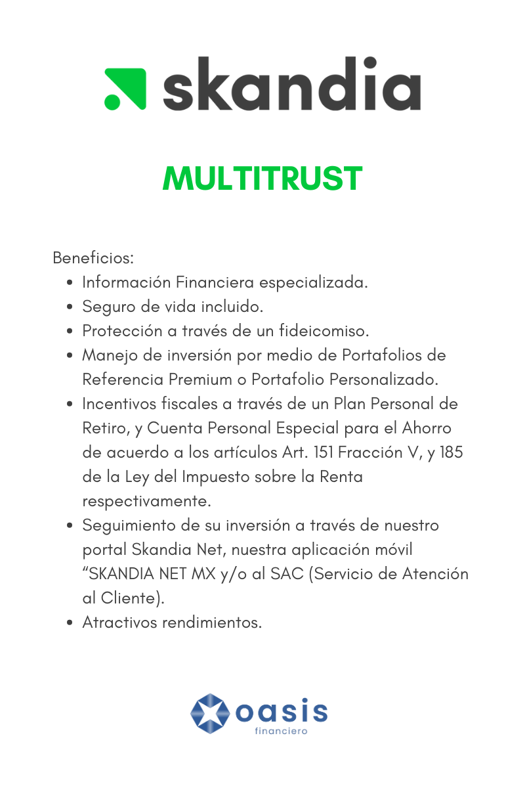
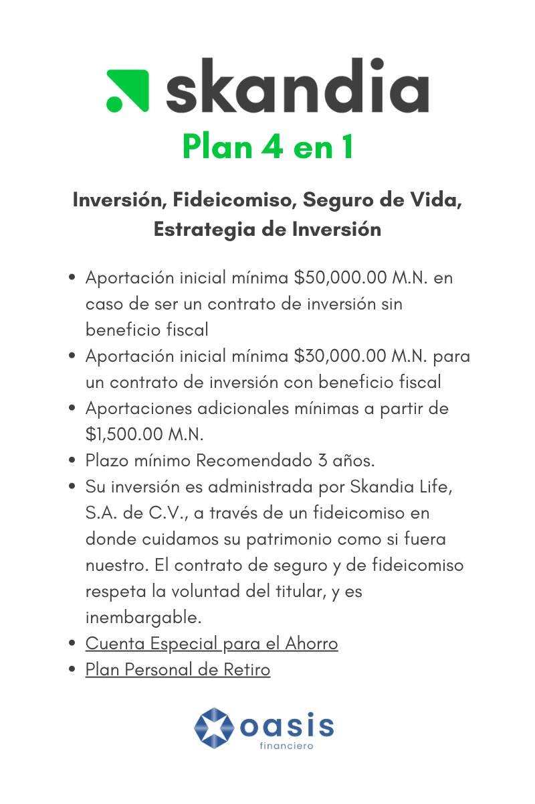

<!--StartFragment-->

En un entorno financiero en constante cambio, donde la estabilidad puede parecer esquiva, las inversiones seguras se convierten en un ancla vital para la seguridad y el crecimiento de los ahorros de cada individuo. Estas inversiones ofrecen una alternativa confiable y rentable a largo plazo, permitiendo que los millennials alcancen sus metas financieras sin comprometer su tranquilidad.  

La importancia de contar con este instrumento financiero no puede ser subestimada. Más allá de simplemente ahorrar, las inversiones seguras permiten a través de una cuidadosa selección de instrumentos financieros diseñados para minimizar los riesgos, es posible obtener rendimientos estables y consistentes en el tiempo.  

## **¿Qué es Skandia?**  

Skandia México es una empresa con más de 65 años de experiencia en el país, comprometida en empoderar a las personas para construir un futuro financiero sólido. Con un enfoque en la creación de planes financieros personalizados, Skandia asesora a sus clientes en cómo invertir, ahorrar y protegerse, brindando soluciones integrales adaptadas a sus necesidades.  

Respaldada por un holding financiero internacional sólido, cuenta con un equipo de expertos en administración de inversiones y ha obtenido reconocimientos como la certificación Top Employer y calificaciones destacadas de calificadoras como Fitch Ratings y CityWire.  

<!--EndFragment-->

## **MULTITRUST**​​​​  

#### **PA​RA INVERSIONISTAS QUE DESEAN PRESERVAR SU CAPITAL**  

<!--EndFragment-->

Multitrust es un producto de Skandia diseñado para inversionistas que desean preservar su capital y aumentar su patrimonio a través de diferentes estrategias de inversión. Ofrece beneficios como información financiera especializada, seguro de vida incluido y protección a través de un fideicomiso. Además, permite el manejo de inversiones mediante Portafolios de Referencia Premium o un Portafolio Personalizado.  

  

  

  