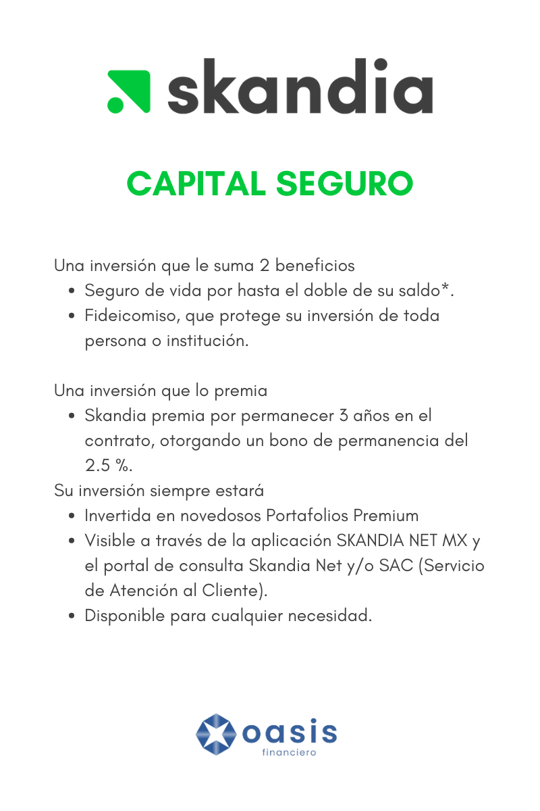

En un entorno financiero en constante cambio, donde la estabilidad puede parecer esquiva, las inversiones seguras se convierten en un ancla vital para la seguridad y el crecimiento de los ahorros de cada individuo. Estas inversiones ofrecen una alternativa confiable y rentable a largo plazo, permitiendo que las personas alcancen sus metas financieras sin comprometer su tranquilidad.  

La importancia de contar con este instrumento financiero no puede ser subestimada. Más allá de simplemente ahorrar, las inversiones seguras permiten a través de una cuidadosa selección de instrumentos financieros diseñados para minimizar los riesgos, es posible obtener rendimientos estables y consistentes en el tiempo.  

La visión de **Skandia** es ser uno de los aliados más confiables y apasionados en la contribución al logro de los objetivos financieros de sus clientes. Por esta razón, Skandia se preocupa por ofrecer productos que ponen a disposición de sus clientes una multiplataforma de inversión con los mejores fondos de renta variable y deuda, tanto a nivel nacional como internacional, provenientes de instituciones financieras sólidas y bien posicionadas en el mercado.  

Asimismo, Skandia permite a sus clientes definir el manejo de su dinero a través de portafolios personalizados, o pueden optar por los novedosos Portafolios Premium o Portafolios Skandia.  

Skandia cuenta con productos destacados como **MULTITRUST**, **CAPITAL SEGURO** y **CAPITAL PLUS**, cada uno diseñado para satisfacer diferentes necesidades y objetivos de inversión. Estos productos ofrecen a los clientes de Skandia la flexibilidad y diversificación necesarias para alcanzar sus metas financieras de manera eficiente y adaptada a sus circunstancias individuales.  

## **¿Qué es Skandia?**  

Skandia México es una empresa con más de 65 años de experiencia en el país, comprometida en empoderar a las personas para construir un futuro financiero sólido. Con un enfoque en la creación de planes financieros personalizados, Skandia asesora a sus clientes en cómo invertir, ahorrar y protegerse, brindando soluciones integrales adaptadas a sus necesidades.  

Respaldada por un holding financiero internacional sólido, cuenta con un equipo de expertos en administración de inversiones y ha obtenido reconocimientos como la certificación Top Employer y calificaciones destacadas de calificadoras como Fitch Ratings y CityWire.  

## **MULTITRUST**​​​​  

#### **PA​RA INVERSIONISTAS QUE DESEAN PRESERVAR SU CAPITAL.**  

Multitrust es un producto de Skandia diseñado para inversionistas que desean preservar su capital y aumentar su patrimonio a través de diferentes estrategias de inversión. Ofrece beneficios como información financiera especializada, seguro de vida incluido y protección a través de un fideicomiso. Además, permite el manejo de inversiones mediante Portafolios de Referencia Premium o un Portafolio Personalizado.  

  

  

## **CAPITAL SEGURO**​​​​  

#### **UNA INVERSIÓN QUE VALORA Y PROTEGE A LOS QUE MÁS AMA​.**  

Capital Seguro es una inversión diseñada para valorar y proteger a las personas más importantes en su vida. Se trata de un plan de inversión que combina dos beneficios clave, permitiéndole proteger a su familia, pareja, padres u otros seres queridos como beneficiarios, con un monto que puede ser hasta el doble de su saldo. Al mismo tiempo, este plan le brinda la oportunidad de mantener o aumentar el valor de su capital a través de una amplia variedad de instrumentos financieros tanto a nivel local como global.  

  

  

####   

## **CAPITAL PLUS**​​​​  

#### **EL PLUS QUE TU CAPITAL ESPERABA.** ​  

Esta solución de inversión ofrece la posibilidad de maximizar un capital al obtener los mejores rendimientos a través de Fondos administrados según el perfil del inversionista, con un enfoque en un horizonte de tiempo de mediano a largo plazo.  

  

  

En conclusión, **Skandia México** es una empresa de renombre con una amplia experiencia en el sector financiero, comprometida en brindar soluciones financieras personalizadas para construir un futuro sólido. Respaldada por un holding financiero internacional y respaldada por expertos en administración de inversiones, Skandia asesora a sus clientes en cómo invertir, ahorrar y protegerse.  

Con Skandia, los inversionistas tienen acceso a una variedad de opciones adaptadas a sus necesidades individuales, respaldadas por una empresa confiable y reconocida en el mercado. Ya sea para preservar el capital, proteger a los seres queridos o maximizar los rendimientos, Skandia ofrece soluciones integrales que ayudan a los inversionistas a alcanzar sus metas financieras.  

#### **¡No esperes más y comienza a construir tu futuro financiero!**   

Te invitamos a contactar a uno de nuestros asesores expertos. Ellos estarán encantados de brindarte toda la información que necesitas y guiarte en el proceso de contratación.  

#### Haz clic en el siguiente enlace para acceder a nuestro formulario de contacto y solicitar una asesoría personalizada:  

### **[Enlace al formulario de contacto](https://docs.google.com/forms/d/e/1FAIpQLSev-GJI8NVfKd_wN65mKoWWtLePumYbSNYj3mIGzbSsLA3uxA/viewform?usp=sf_link).**  

Nuestros asesores te brindarán una atención personalizada y te ayudarán a seleccionar el plan de inversión que mejor se adapte a tus necesidades y metas financieras.   

Haz clic en el enlace y da el primer paso hacia una vida financiera segura y próspera. ¡Te esperamos para acompañarte en esta emocionante travesía hacia el éxito financiero!  

#### Te recomendamos el artículo:  

# [Ahorro con poder: Skandia ofrece planes para alcanzar tus metas financieras.](https://www.oasisfinanciero.mx/blog/2023-06-03/ahorro-con-poder-skandia-ofrece-planes-para-alcanzar-tus-metas-financieras/)