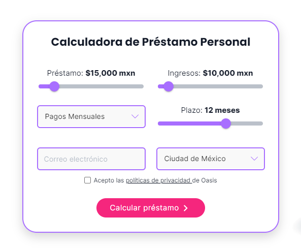
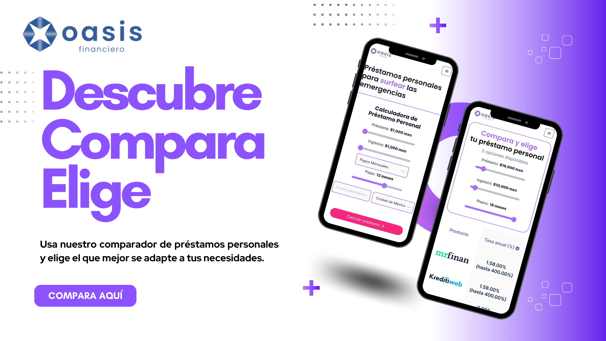

En el mundo financiero actual, los préstamos personales pueden ser una herramienta valiosa para alcanzar metas y superar desafíos. Sin embargo, es esencial abordar este proceso con conocimiento y planificación para asegurarte de tomar decisiones financieras informadas y responsables. En esta guía, te proporcionaremos una hoja de ruta detallada para solicitar préstamos personales de manera estratégica, junto con consejos prácticos y una herramienta especial que hará que el proceso sea más fácil que nunca.   

**Paso 1: Evalúa tus Necesidades y Capacidad de Pago.** Antes de sumergirte en el mundo de los préstamos personales, es crucial tener una comprensión clara de tus necesidades financieras y tu capacidad para cumplir con los pagos. Evalúa cuidadosamente cuánto dinero realmente necesitas y cuánto puedes destinar mensualmente a los pagos del préstamo sin afectar tu presupuesto.   

**Paso 2: Compara Diferentes Opciones de Préstamos.** En el vasto panorama de préstamos personales, encontrarás una variedad de opciones, desde préstamos con tasas fijas hasta préstamos con tasas variables. Investiga y compara estas opciones para determinar cuál se alinea mejor con tus objetivos. Considera factores como la tasa de interés, los plazos y las condiciones de pago.   

**Paso 3: Verifica tu Historial Crediticio.** Tu historial crediticio desempeña un papel crucial en la aprobación de tu préstamo y en la tasa de interés que recibirás. Antes de solicitar un préstamo, verifica tu historial crediticio y toma medidas para mejorarlo si es necesario.   

**Paso 4: Explora Tasas de Interés y Términos.** Las tasas de interés y los plazos pueden afectar significativamente el costo total de tu préstamo. Aprovecha herramientas en línea y calculadoras de préstamos para comparar diferentes tasas y términos, y elige la opción que te brinde la mejor combinación de asequibilidad y flexibilidad.   

<!--StartFragment-->

## **¿Necesitas un préstamo? Encuentra el préstamo perfecto para tí.**  

  

**Paso 5: Lee la Letra Pequeña.** Antes de firmar cualquier acuerdo, es esencial leer y comprender los términos y condiciones del préstamo. Presta atención a las tarifas ocultas, los cargos por pagos atrasados y otros detalles importantes que podrían afectar tus finanzas a largo plazo.   

**Paso 6: Utiliza el Comparador de Préstamos Personales de Oasis Financiero.** Para facilitar aún más tu búsqueda del préstamo perfecto, Oasis Financiero te ofrece su **[Comparador de Préstamos Personales](https://www.oasisfinanciero.com/compara/prestamos-personales).** Esta herramienta te permite comparar rápidamente diferentes ofertas de préstamos en el mercado y encontrar la opción más adecuada para ti en función de tus necesidades y capacidad de pago.   

**\*Explora Opciones de Prestamistas Confiables.** En tu búsqueda de préstamos personales, es esencial tener acceso a prestamistas confiables y respetables. Nuestros aliados comerciales ofrecen opciones de préstamos que cumplen con los estándares de integridad y servicio al cliente.   *

**Paso 7: Prepara tu Documentación.** Una vez que hayas elegido un préstamo, asegúrate de tener todos los documentos necesarios en orden. Esto incluye comprobantes de ingresos, información de empleo y otros documentos que el prestamista pueda requerir.   

**Paso 8: Completa tu Solicitud de Préstamo.** El proceso de solicitud de préstamo puede variar según el prestamista, pero generalmente implicará proporcionar información personal y financiera. Asegúrate de completar todos los campos con precisión y honestidad.   

**Paso 9: Evalúa la Oferta y Toma una Decisión Informada.** Una vez que hayas presentado tu solicitud, es probable que recibas varias ofertas de préstamos. Tómate el tiempo para comparar estas ofertas y evaluar cuál se adapta mejor a tus necesidades y objetivos financieros.   

  

**Consejos Extra:**   

* Negocia con los prestamistas si es posible para obtener mejores condiciones.
* Utiliza el préstamo personal de manera estratégica para alcanzar metas financieras, como consolidar deudas o financiar gastos importantes.   

\*En conclusión, solicitar un préstamo personal es una decisión financiera importante que requiere investigación y planificación cuidadosas. Utiliza esta guía como tu recurso definitivo para tomar decisiones informadas y responsables.   

Aprovecha nuestro **[Comparador de Préstamos Personales](https://www.oasisfinanciero.com/compara/prestamos-personales)** para simplificar tu proceso de búsqueda y encontrar la opción ideal para tus necesidades.*  

<!--EndFragment-->