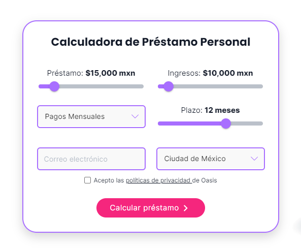

## **¿Qué son las criptomonedas?**  

Las criptomonedas son activos digitales que emplean un cifrado criptográfico para garantizar su titularidad y asegurar la integridad de las transacciones, y controlar la creación de unidades adicionales. Estas monedas no existen de forma física: se almacenan en una cartera digital.  

### **¿Cómo funcionan las criptomonedas?**  

Las criptomonedas funcionan mediante la tecnología **blockchain**, un sistema de registro distribuido que registra las transacciones de manera segura y transparente. La blockchain es una base de datos descentralizada que se almacena en una red de computadoras. Cada transacción de criptomoneda se registra en la blockchain, lo que la hace imposible de falsificar o manipular.  

## **¿Necesitas un préstamo? Encuentra el préstamo perfecto para tí.**  

  

### **Ventajas de las criptomonedas.**  

Las criptomonedas ofrecen una serie de ventajas sobre las monedas tradicionales, como:  

* **Seguridad:** La criptografía utilizada para proteger las criptomonedas las hace muy seguras contra el fraude y el robo.  
* **Transparencia:** La blockchain es un sistema transparente que permite a todos ver las transacciones que se realizan.  
* **Independencia:** Las criptomonedas no están respaldadas por ningún gobierno o entidad central, lo que les da a los usuarios un mayor control sobre sus finanzas.  

**Desventajas de las criptomonedas.**  

Las criptomonedas también tienen algunas desventajas, como:  

* **Volatilidad:** El precio de las criptomonedas puede ser muy volátil, lo que significa que puede subir o bajar rápidamente.  
* **Infraestructura:** La infraestructura para usar criptomonedas, como los monederos digitales y los intercambios, aún está en desarrollo.  
* **Regulación:** Las criptomonedas no están reguladas en la mayoría de los países, lo que puede crear riesgos para los usuarios.  

### **¿Cómo se crean las criptomonedas?**  

Las criptomonedas se crean mediante un proceso llamado minería. Los mineros son personas o empresas que utilizan sus computadoras para resolver complejos problemas matemáticos. Al resolver estos problemas, los mineros reciben recompensas en forma de criptomonedas.  

### **¿Cuáles son las principales criptomonedas?**  

La criptomoneda más popular es Bitcoin, que fue creada en 2009. Otras criptomonedas populares incluyen Ethereum, Litecoin, Cardano y Solana.  

### **¿Cómo se pueden adquirir criptomonedas?**  

Las criptomonedas se pueden adquirir mediante la compra o intercambio de la propia moneda en portales especializados. También se pueden obtener mediante la minería, pero este proceso es cada vez más difícil y costoso.  

### **¿Qué es un monedero digital?**  

Un monedero digital, también conocido como wallet, es un software o aplicación donde es posible almacenar, enviar y recibir criptomonedas. Los monederos digitales se clasifican en dos tipos: calientes y fríos.  

* **Monedero caliente:** Un monedero caliente es un monedero digital que está conectado a internet. Esto significa que es más vulnerable a los ataques informáticos.
* **Monedero frío:** Un monedero frío es un monedero digital que no está conectado a internet. Esto lo hace más seguro, pero también más difícil de usar.

  

#### **¿Qué es la minería de criptomonedas?**  

La minería de criptomonedas es el proceso de crear nuevas criptomonedas. Los mineros son personas o empresas que utilizan sus computadoras para resolver complejos problemas matemáticos. Al resolver estos problemas, los mineros reciben recompensas en forma de criptomonedas.  

#### **¿Cómo se determina el valor de una criptomoneda?**  

El valor de una criptomoneda se determina por la oferta y la demanda. A diferencia de las monedas tradicionales, las criptomonedas no están respaldadas por ningún gobierno o entidad central, por lo que su valor es más volátil.  

#### **¿Qué futuro tienen las criptomonedas?**  

El futuro de las criptomonedas es incierto. Algunos expertos creen que las criptomonedas podrían reemplazar a las monedas tradicionales, mientras que otros creen que seguirán siendo un activo especulativo.  

**Conclusión.**  

Las criptomonedas son una tecnología emergente con el potencial de revolucionar el sistema financiero. Sin embargo, es importante ser consciente de los riesgos asociados a las criptomonedas antes de invertir o usarlas.  

**Recomendaciones:**  

Si estás interesado en aprender más sobre las criptomonedas, te recomendamos los siguientes recursos:  

* **Cursos online:** Existen numerosos cursos online que pueden ayudarte a aprender sobre las criptomonedas.  
* **Libros:** Hay muchos libros disponibles sobre criptomonedas.  
* **Foros y comunidades:** Hay muchas comunidades online donde puedes interactuar con otros usuarios de criptomonedas.  

**También es importante tener en cuenta los siguientes consejos antes de invertir o usar criptomonedas:**  

* **Investiga:** Antes de invertir o usar criptomonedas, es importante investigar a fondo para entender cómo funcionan. Esto incluye comprender la tecnología blockchain, los diferentes tipos de criptomonedas y los riesgos asociados a las inversiones en criptomonedas.  
* **Empieza poco a poco:** No inviertas o uses más dinero del que puedas permitirte perder. Las criptomonedas son un activo muy volátil, por lo que su valor puede subir o bajar rápidamente.  
* **Diversifica:** No inviertas todo tu dinero en una sola criptomoneda. Diversifica tu cartera para reducir el riesgo.  
* **Sé paciente:** Las criptomonedas son una inversión a largo plazo. No esperes obtener ganancias rápidas.  

**Algunos consejos adicionales:**  

* **Guarda tus claves de seguridad en un lugar seguro.** Tus claves de seguridad son la única forma de acceder a tus criptomonedas.  
* **No compartas tus claves de seguridad con nadie.** Si alguien conoce tus claves de seguridad, podría robar tus criptomonedas.  
* **Utiliza un monedero digital seguro.** Hay muchos tipos de monederos digitales disponibles. Elige un monedero que sea seguro y que te ofrezca las funciones que necesitas.  
* **Mantente informado de las últimas noticias sobre criptomonedas.** El mercado de criptomonedas es muy volátil, por lo que es importante estar al día de las últimas noticias para poder tomar decisiones informadas.  

Siguiendo estos consejos, podrás reducir el riesgo asociado a las inversiones en criptomonedas y aumentar tus posibilidades de éxito.  

**Te recomendamos:**  

### **[Encuentra el préstamo perfecto para tus necesidades.](https://oasisdev.netlify.app/compara/prestamos-personales)**  

<!--EndFragment-->