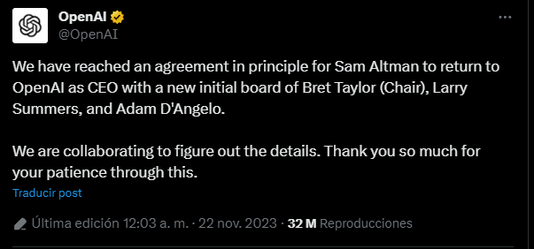

En un sorprendente giro de los acontecimientos, **Sam Altman** ha regresado a **OpenAI** como CEO. Altman fue despedido de la empresa el pasado 17 de noviembre por "pérdida de confianza", pero su marcha provocó un gran malestar entre los empleados e inversores de OpenAI.  

La nueva junta directiva de OpenAI, presidida por Bret Taylor, llegó a un acuerdo con Altman para que regresara a la empresa. El acuerdo también incluye la creación de un nuevo consejo de administración con la participación de Larry Summers y Adam D'Angelo.  

En un comunicado, Altman dijo que estaba "emocionado" de volver a OpenAI. "Estoy agradecido por la oportunidad de trabajar con la nueva junta directiva y con el equipo de OpenAI para construir un futuro para la inteligencia artificial que sea seguro, beneficioso y equitativo", dijo.  

El regreso de Altman a OpenAI supone el final de un capítulo turbulento en la historia de la empresa. El despido de Altman provocó una crisis de confianza en OpenAI, y muchos empleados e inversores amenazaron con renunciar si Altman no regresaba.  

El acuerdo alcanzado por Altman y la nueva junta directiva parece haber calmado las aguas en OpenAI. Sin embargo, queda por ver cómo se desarrollará la relación entre Altman y la nueva junta directiva.  

### **El tuit de OpenAI**  

  

El tuit de OpenAI publicado el 22 de noviembre de 2023 confirma el regreso de Altman a la empresa. El tuit también anuncia la creación de un nuevo consejo de administración con la participación de Larry Summers y Adam D'Angelo.  

El tuit es una señal de que Altman y la nueva junta directiva están trabajando juntos para restaurar la confianza en OpenAI. El nuevo consejo de administración aporta una amplia experiencia y conocimientos en los campos de la tecnología, la economía y la educación.  

### **¿Qué significa el regreso de Altman para OpenAI?**  

El regreso de Altman a OpenAI es un acontecimiento importante para la empresa. Altman es uno de los fundadores de OpenAI, y su liderazgo ha sido fundamental para el éxito de la empresa.  

Altman es un defensor de la inteligencia artificial responsable, y su regreso a OpenAI podría ayudar a la empresa a seguir trabajando en este ámbito. Altman también es un líder carismático, y su regreso podría ayudar a restaurar la confianza en OpenAI.  

Sin embargo, el regreso de Altman también podría plantear algunos desafíos para OpenAI. Altman ha sido criticado por su falta de transparencia, y su regreso podría suscitar nuevas preocupaciones sobre la gobernanza de la empresa.  

**Conclusiones**  

El regreso de Sam Altman a OpenAI es una noticia positiva para la empresa. Altman es un líder experimentado y respetado, y su regreso podría ayudar a OpenAI a seguir siendo una fuerza importante en el campo de la inteligencia artificial.  

Sin embargo, el regreso de Altman también podría plantear algunos desafíos para OpenAI. Altman tendrá que trabajar para restaurar la confianza de los empleados, inversores y partes interesadas.  

**Te recomendamos leer:**  

### [Changpeng Zhao renuncia como CEO de Binance.](https://oasisfinanciero.com/blog/2023-11-21/changpeng-zhao-renuncia-como-ceo-de-binance/)

<!--EndFragment-->