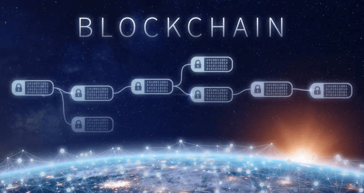

## **¿Qué son los NFT?**  

**Tokens No Fungibles (NFT):** Piensa en ellos como certificados digitales únicos que representan la propiedad o autenticidad de algo en el mundo digital. Estos certificados están asegurados por la tecnología blockchain.  

### **Blockchain y NFT**  

**Blockchain:** Es como un libro de registro digital que garantiza la seguridad y la transparencia de la información. Los NFT utilizan blockchain para asegurar la propiedad y autenticidad de los activos digitales.  

### **Creación de NFT**  

1. **Digitalización del Contenido:** Desde videos virales hasta momentos icónicos, cualquier cosa digitalizable puede convertirse en un NFT.Ejemplo: Un clip viral de internet, como el "Nyan Cat", puede convertirse en un NFT y ser poseído por alguien exclusivamente.  
2. **Plataformas NFT:** Además de artistas y músicos, empresas pueden crear NFT para productos digitales exclusivos o incluso para representar acciones digitales.Ejemplo: Una empresa de tecnología lanza una edición limitada de NFT para representar acciones virtuales, permitiendo a los inversores tener una representación única de sus inversiones.  
3. **Contratos Inteligentes:** Más allá de los activos digitales, los NFT también pueden representar contratos legales y laborales.Ejemplo: Un contrato de trabajo puede convertirse en un NFT, garantizando la autenticidad y los términos acordados entre un empleado y un empleador.  

### **Casos de Uso de los NFT**  

1. **Arte Digital:** Los NFT han permitido a los artistas digitales vender obras directamente a los compradores, eliminando intermediarios.Ejemplo: Una galería de arte crea NFT para representar obras digitales exclusivas que los compradores pueden adquirir y poseer de manera única.  
2. **Música y Entretenimiento:** Más allá de las canciones, los NFT pueden representar experiencias exclusivas, como meet and greets virtuales.Ejemplo: Una banda crea NFT para representar entradas exclusivas que incluyen acceso a conciertos en línea y oportunidades para interactuar con los artistas.  
3. **Juegos:** Los NFT en juegos no solo se limitan a objetos virtuales, también pueden representar participación en torneos o incluso derechos especiales dentro del juego.Ejemplo: Un juego en línea ofrece NFT que representan entradas para participar en torneos exclusivos con premios especiales.  
4. **Propiedad Virtual:** Empresas de bienes raíces pueden utilizar NFT para representar la propiedad digital de bienes virtuales.Ejemplo: Una plataforma de bienes raíces virtuales emite NFT para representar la propiedad exclusiva de propiedades digitales, permitiendo a los propietarios vender y comerciar con ellas.  
5. **Coleccionables Digitales:** Desde tarjetas de béisbol virtuales hasta ítems de colección digital, los NFT han ampliado el mundo de los coleccionables.Ejemplo: Una empresa de juguetes crea NFT para representar ediciones limitadas de juguetes virtuales, que los coleccionistas pueden comprar y vender.  

### **Aplicaciones Empresariales y Legales de los NFT**  

1. **Contratos Legales:** Los contratos legales pueden ser tokenizados como NFT para mayor seguridad y trazabilidad.Ejemplo: Un bufete de abogados emite NFT que representan contratos legales, garantizando la autenticidad y la integridad del documento.  
2. **Certificación de Propiedad Intelectual:** Artistas, escritores y creadores pueden usar NFT para certificar la propiedad intelectual de sus obras.Ejemplo: Un autor tokeniza su último libro como un NFT, asegurando la propiedad y autenticidad de la obra.  
3. **Recompensas Laborales:** Las empresas pueden utilizar NFT como recompensas para empleados destacados, representando reconocimientos laborales digitales.Ejemplo: Una empresa emite NFT a los empleados por logros sobresalientes, que pueden intercambiar por beneficios o reconocimientos especiales.  
4. **Activos Digitales de Empresas:** Las empresas pueden tokenizar activos digitales exclusivos, como logotipos o contenido de marca.Ejemplo: Una empresa de tecnología emite NFT que representan su logotipo exclusivo, permitiendo a los seguidores poseer una parte digital de la marca.  

### **Últimas Innovaciones**  

1. **NFT Delegables:** Facilita la transferencia de propiedad o derechos sin cambiar la propiedad real del NFT.Ejemplo: Una empresa delega temporalmente los derechos de un NFT representando un producto digital a un colaborador externo para su uso promocional.  
2. **NFT Interoperables:** Algunos NFT pueden utilizarse en diferentes plataformas y mundos virtuales.Ejemplo: Un NFT que representa una suscripción premium a una plataforma de streaming también otorga beneficios en un juego en línea.  
3. **NFT Programables:** Contratos inteligentes avanzados que permiten comportamientos complejos y personalizados.Ejemplo: Un contrato inteligente de NFT puede incluir cláusulas automatizadas para regalías dinámicas, distribuyendo automáticamente ingresos a diferentes partes cada vez que se realiza una venta.  

### **Consejos para Compradores y Vendedores**  

1. **Investigación:** Al comprar NFT empresariales o legales, asegúrate de entender completamente los términos y condiciones asociados.Ejemplo: Antes de adquirir un NFT que representa un contrato legal, revisa cuidadosamente los detalles y las obligaciones involucradas.  
2. **Gestión de Billetera:** Las empresas deben utilizar billeteras seguras y seguir las mejores prácticas de seguridad para proteger sus activos digitales.Ejemplo: Una empresa utiliza billeteras hardware para almacenar sus NFT empresariales, garantizando la seguridad de sus activos digitales.  
3. **Diversificación Empresarial:** Al igual que los creadores, las empresas pueden diversificar sus activos digitales en diferentes plataformas para maximizar su alcance.Ejemplo: Una empresa emite NFT en múltiples plataformas para llegar a diferentes audiencias y aumentar la visibilidad de sus activos digitales.  

### **Plataformas de Creación y Comercio de NFT**  

1. **OpenSea:** Una de las plataformas más grandes y populares para la creación y comercio de NFT en diversas categorías, desde arte hasta juegos.  
2. **Rarible:** Permite a los usuarios crear, comprar y vender NFT fácilmente, con un enfoque en la personalización y la creatividad.  
3. **Mintable:** Ofrece herramientas simples para crear y gestionar NFT, con opciones para personalizar contratos inteligentes.  
4. **SuperRare:** Especializada en arte digital, SuperRare destaca por su enfoque en obras de alta calidad y limitadas.  
5. **Foundation:** Una plataforma que destaca el apoyo a artistas emergentes, donde los coleccionistas pueden descubrir y respaldar nuevas creaciones.  
6. **Binance NFT Marketplace:** Con el respaldo de una importante plataforma de intercambio de criptomonedas, Binance ofrece un mercado dedicado a NFT.  
7. **Enjin:** Enfocada en juegos, Enjin permite la creación y gestión de activos digitales tokenizados para entornos de juego.  
8. **Polygon (anteriormente Matic):** Una capa 2 de Ethereum que ofrece transacciones más rápidas y menos costosas, siendo utilizada por varias plataformas de NFT.  

### **Conclusión**  

Los Tokens No Fungibles (NFT) están redefiniendo la forma en que interactuamos con el mundo digital, tanto a nivel individual como empresarial. Desde la representación única de activos digitales hasta la tokenización de contratos legales y recompensas laborales, los NFT ofrecen un abanico de posibilidades que trascienden el arte y el entretenimiento.  

Empresas y creadores pueden aprovechar la tecnología blockchain para garantizar la autenticidad, propiedad y trazabilidad de activos digitales. Los NFT no solo son una forma innovadora de monetizar la creatividad, sino que también ofrecen soluciones eficientes para contratos legales, certificación de propiedad intelectual y reconocimientos laborales.  

La descentralización y la seguridad inherentes a los NFT están transformando la manera en que concebimos la propiedad y el intercambio en el entorno digital. Al mismo tiempo, las últimas innovaciones, como NFT delegables, interoperables y programables, están ampliando aún más las posibilidades y la funcionalidad de estos tokens.  

### **Sigue tu aprendizaje con esta guía:**  

### **[Guía para entender la tecnología Blockchain.](https://oasisfinanciero.com/blog/2023-11-23/guia-para-entender-la-tecnologia-blockchain/)  **

<!--EndFragment-->