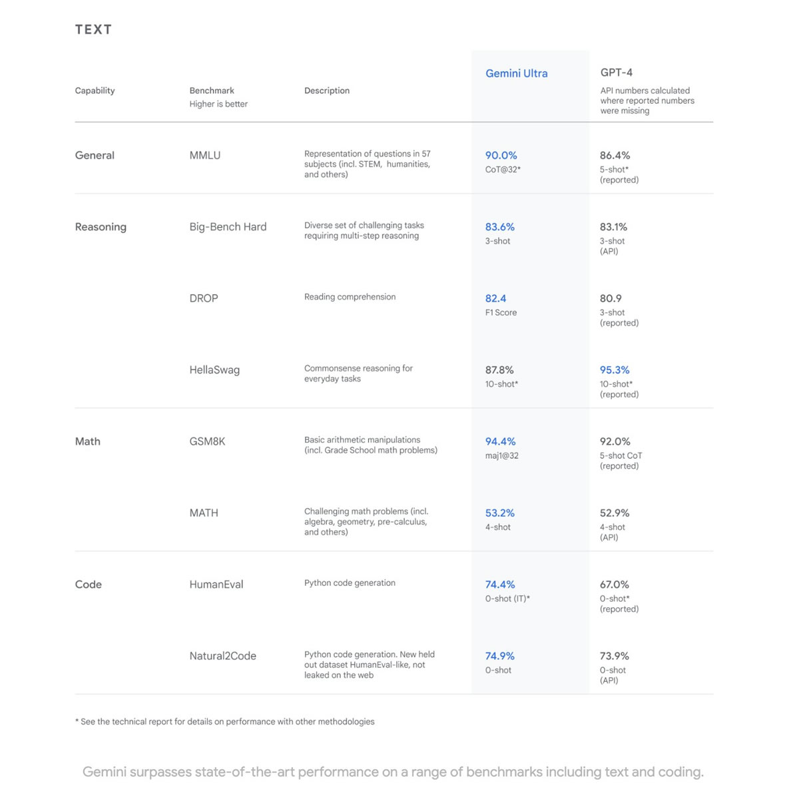

La inteligencia artificial (IA) es una fuerza transformadora que está dando forma al futuro de la tecnología y la innovación. Google, como una empresa líder en este campo, está marcando un hito significativo con la introducción de Gemini, su modelo de IA más avanzado hasta la fecha.  

El 6 de diciembre **Google DeepMind** presentó a **Gemini**, un modelo de inteligencia artificial (IA) multimodal y flexible que promete revolucionar la manera en que la tecnología se entrelaza con la cotidianidad y el desarrollo empresarial.  

Gemini es un modelo de IA multimodal, lo que significa que puede generar y comprender, operar y combinar a la perfección diferentes tipos de datos, como texto, imágenes, audio y video. Esto le permite realizar tareas complejas que serían difíciles o imposibles para otros modelos de IA.  

Por ejemplo, Gemini puede ser utilizado para:  

* Generar traducciones de alta calidad entre idiomas  
* Crear contenido creativo, como poemas, historias o guiones  
* Responder preguntas de manera informativa, incluso si son abiertas, desafiantes o extrañas  
* Detectar patrones y tendencias en grandes conjuntos de datos  

Gemini ha sido entrenado en un conjunto de datos masivo de texto e imágenes, lo que le permite aprender sobre el mundo y comprender las relaciones entre diferentes conceptos. Esto lo hace capaz de realizar tareas que serían imposibles para los humanos, como comprender el significado de un texto en un idioma que no conocen.  

Ha sido diseñada desde cero para razonar de manera fluida a través de texto, imágenes, audio y video, colocándola un paso adelante en la carrera de la inteligencia artificial. Rowan Cheung, experto en IA, destaca que Gemini Pro ha superado a GPT-3.5 en seis de ocho evaluaciones, consolidándolo como el chatbot gratuito más potente disponible en el mercado actual.  

Además, Gemini se integrará en el Pixel 8 Pro de Google, convirtiéndolo en el primer teléfono inteligente diseñado para ejecutar Gemini Nano. Esta implementación potenciará funciones como el resumen en la aplicación Recorder y se extenderá a Smart Reply en Gboard, comenzando con WhatsApp y expandiéndose a otras aplicaciones de mensajería en el próximo año.  

Google tiene planes ambiciosos para Gemini, anunciando su implementación en servicios clave como Search, Ads y Chrome en los próximos meses. Esto no solo reducirá la latencia, sino que mejorará significativamente la experiencia del usuario. Además, la compañía ha iniciado experimentos para utilizar Gemini como motor generativo en su motor de búsqueda web principal.  

Gemini ha sido meticulosamente desarrollado como un modelo multimodal, optimizado para diversos tamaños y casos de uso, desde Ultra hasta Nano. Este avance va más allá de las capacidades de su competidor GPT-4, especialmente en matemáticas y programación especializada, donde Gemini Ultra demuestra un rendimiento de última generación en 30 de 32 pruebas académicas, incluyendo una destacada puntuación del 90% en comprensión del lenguaje multitarea masivo (MMLU).  

  

## **Gemini Ultra, la versión más avanzada**  

Google también ha anunciado el desarrollo de Gemini Ultra, una versión más avanzada del modelo que está siendo sometida a pruebas de seguridad y confianza. Gemini Ultra está diseñado para ser aún más potente y versátil que Gemini, y se espera que esté disponible para el público general a principios de 2024.  

Una versión optimizada de Gemini Pro ya ha sido implementada en el chatbot de Google, conocido como Bard, marcando la actualización más significativa desde su lanzamiento. Esta versión estará disponible inicialmente en inglés, expandiéndose a más de 170 países y territorios con planes de inclusión de nuevas modalidades y soporte para diversos idiomas en el futuro cercano.  

El lanzamiento de Gemini es un hito importante en el desarrollo de la IA. El modelo tiene el potencial de revolucionar la manera en que interactuamos con la tecnología y el mundo que nos rodea.  

En resumen, Gemini no es solo un modelo de inteligencia artificial; es la vanguardia de la innovación en el mundo empresarial. Sus capacidades multimodales y su rendimiento excepcional en pruebas académicas y aplicaciones prácticas lo convierten en una herramienta revolucionaria con un potencial transformador.  

**Te recomendamos leer:**  

### **[Guía para entender la tecnología Blockchain.](https://oasisfinanciero.com/blog/2023-11-23/guia-para-entender-la-tecnologia-blockchain/)**  

<!--EndFragment-->