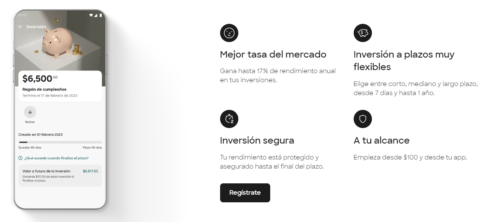
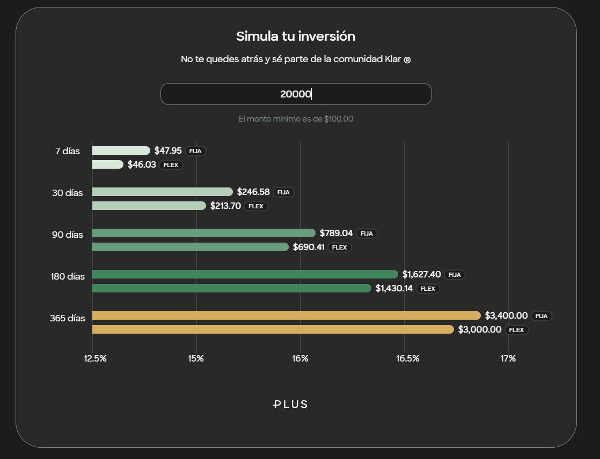
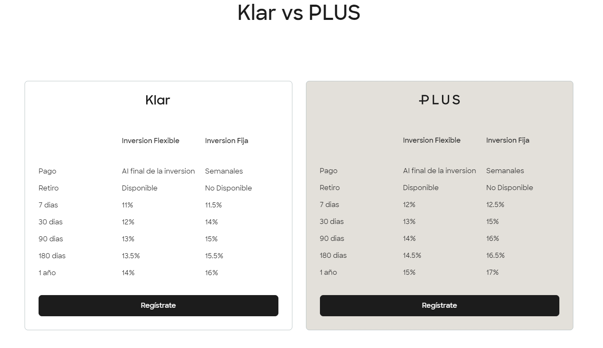

### **¿Qué es Klar?**  

**[Klar](https://www.klar.mx/),** una Sofipo regulada por la Comisión Nacional Bancaria y de Valores, ha elevado su rendimiento anual al 17%, superando a empresas como Nu y Stori. Sin embargo, a diferencia de otras opciones, este rendimiento del 17% está vinculado a inversiones que no son visibles, lo que significa que el dinero no está disponible para retiros inmediatos.  

**¿Realidad o Letras Chiquitas?**  

En la constante competencia por ofrecer mayores rendimientos a los clientes, la plataforma financiera mexicana **Klar** ha dado un golpe sorprendente al superar a sus competidores con una oferta de hasta 17% de rendimiento anual en su cuenta de inversión. Sin embargo, como en toda propuesta atractiva, es esencial leer detenidamente las condiciones antes de sumergirse en esta nueva oferta financiera.  

**Creación de una Inversión Klar:**  

* **¿Cómo inicio una inversión Klar?**  

  * Simplemente inicia sesión en tu aplicación Klar, ve a "Detalles" de tu saldo disponible y haz clic en "Inversión".
  * Obtén información sobre cómo ahorrar con tu inversión y haz clic en "Continuar" para calcular tu inversión.  
* **¿Cómo determino el monto y plazo de mi inversión?**  

  * Elige el monto a invertir, decide entre plazo fijo o flexible, y selecciona la duración (7, 30, 90, o 365 días).
  * Mayor ahorro y tiempo invertido significan mayores ganancias. El monto mínimo para comenzar es de $100.00 MXN.  
* **¿Cómo confirmo mi inversión?**  

  * Visualiza las ganancias al final de cada periodo.
  * Confirma tu inversión y el monto se transfiere. Decide qué hacer con tu dinero al finalizar el plazo.  
* **¿Qué opciones tengo con Inversión Flexible?**  

  * Hasta 15 inversiones simultáneas.
  * Posibilidad de retirar antes del plazo con la opción flexible.
  * Ganancias calculadas según el monto invertido al final del periodo  

## **¿Necesitas un préstamo? Encuentra el préstamo perfecto para tí.**

  

  

**Funcionamiento de Inversión Klar:**  

* **¿Cómo opera Inversión Klar?**  

  * Permite ahorrar durante el tiempo elegido, generando intereses sobre la cantidad invertida.
  * Hasta 15 inversiones simultáneas y opción de elegir entre inversión flexible o plazo fijo.  
* **¿Desde cuánto puedo comenzar a invertir?**  

  * Inversión desde $100.00 MXN.
  * El monto invertido más los intereses se reciben al finalizar el plazo.  
* **¿Cómo creo mi primera Inversión Klar?**  

  * Sigue una guía simple en la aplicación o dirígete a "Saldo disponible" y sigue los pasos.
  * Elige monto, tipo de inversión, y plazo. El monto se descuenta y se refleja en tu Inversión.  
* **¿Qué sucede si necesito retirar antes del plazo?**  

  * Dos opciones de inversión, posibilidad de retirar con inversión flexible.
  * Retiros parciales afectan ganancias; retiro total implica ninguna ganancia.  
* **¿Cuál es el monto mínimo para abrir una Inversión Klar?**  

  * Apertura desde $100.00 MXN.
  * Selecciona monto y tipo de inversión en la aplicación, con mayor plazo para mayores ganancias.

  

  

#### **[Crea tu cuenta de Klar aquí](https://signup-flutter.klar.mx/steps/email?_gl=1*hmmvvf*_ga*MzU0MjE1MjgzLjE3MDc4NzU3Njk.*_ga_GBTLZ68PC3*MTcwODA0MjQ1MS41LjEuMTcwODA0NTg2OC4zMy4wLjA.)**  

En esta simulación podemos ver de manera más clara como funciona Klar Plus. Esta información solo muestra un supuesto ya que los rendimientos pueden varias por diversas causas.   

Fecha de la simulación 15/02/2024

  

### **Comparativa entre Klar y Klar Plus**  

Fecha de comparación 25/02/2024

  

**Plazos e Intereses de Inversión Flexible:**  

* **¿Cuáles son los plazos e intereses en Inversión Flexible?**  

  * Plazos de 7, 30, 90, 180, y 365 días con tasas anuales del 11%, 12%, 13%, 13.5%, y 14% respectivamente.
  * Inversión flexible disponible desde $100.00 MXN.  

**Plazos e Intereses de Inversión a Plazo Fijo:**  

* **¿Cuáles son los plazos e intereses de Inversión a plazo fijo?**  

  * En Inversión Klar, puedes optar por una inversión a plazo fijo o flexible.
  * En la inversión a plazo fijo, tu dinero permanece invertido hasta el final del plazo elegido, sin posibilidad de retiro antes. Se emite una constancia de inversión.
  * La inversión flexible permite retiros totales o parciales en cualquier momento, con un resumen detallado enviado por correo al crearla, incluyendo monto, plazo, rendimiento y enlace a los Términos y Condiciones.  

**Comparación de Rendimientos:**  

* **¿Qué inversión da más rendimiento?**

  * Klar ofrece hasta un 17% anual en su modalidad de Inversión Fija con Klar Plus, dependiendo del plazo seleccionado.
  * Las inversiones a plazo fijo suelen proporcionar rendimientos más altos en comparación con las flexibles.  

**Inversiones con Poco Dinero:**  

* **¿En qué se puede invertir con poco dinero?**

  * Invertir con Klar es accesible, comenzando desde $100 MXN.
  * Selecciona entre inversiones fijas o flexibles, adaptándolas a tus necesidades y capacidad económica.  

**Conceptos Básicos de Inversión:**  

* **¿Qué es una inversión y cómo funciona?**

  * La inversión implica destinar dinero con la meta de obtener beneficios en el futuro.
  * En Klar, inviertes durante un periodo elegido, generando intereses. Cuanto más tiempo mantengas la inversión, mayores serán las ganancias.  

**Elección del Mejor Plazo:**  

* **¿Cuál es el mejor plazo para invertir?**

  * La elección depende de tus objetivos y necesidades financieras.
  * Con Klar, selecciona plazos de 7 días hasta un año, con rendimientos que varían según la duración y tipo de inversión.
  * Los plazos más largos tienden a ofrecer rendimientos superiores.

  

**Conclusiones y Reflexiones**.  

La oferta disruptiva de Klar en el mercado financiero mexicano ha generado un revuelo significativo. A pesar de la atractiva tasa de rendimiento del 17%, los usuarios deben considerar cuidadosamente las condiciones específicas antes de decidirse a invertir. La competencia en el sector financiero sigue evolucionando, y la propuesta de Klar es un claro ejemplo de cómo las empresas buscan destacar y captar la atención de los inversionistas en busca de oportunidades rentables.  

#### **[Crea tu cuenta de Klar aquí](https://signup-flutter.klar.mx/steps/email?_gl=1*hmmvvf*_ga*MzU0MjE1MjgzLjE3MDc4NzU3Njk.*_ga_GBTLZ68PC3*MTcwODA0MjQ1MS41LjEuMTcwODA0NTg2OC4zMy4wLjA.)**  

**Te recomendamos leer:**

<!--StartFragment-->

## **[Guía Financiera para Jóvenes: Manejando tu Primer Sueldo.](https://oasisfinanciero.com/blog/2024-01-14/guia-financiera-para-jovenes-manejando-tu-primer-sueldo/)**

