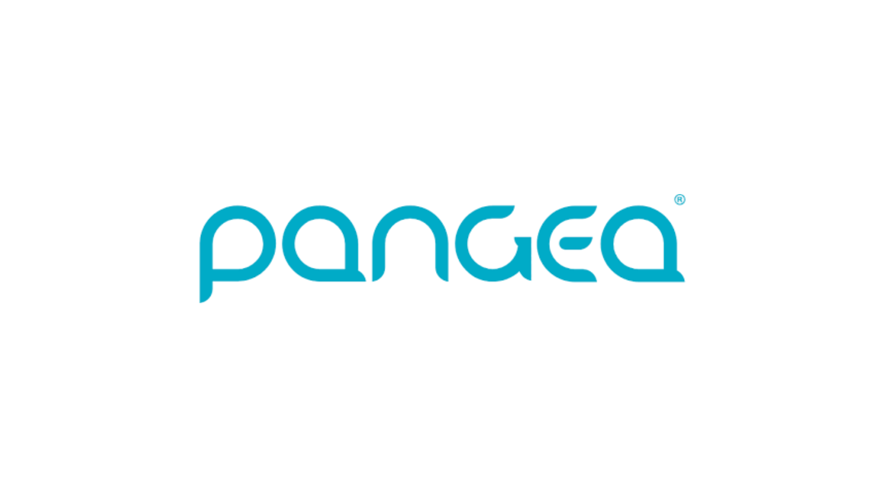

<!--StartFragment-->

El ecosistema fintech en Latinoamérica ha crecido de manera exponencial en los últimos años, impulsado por la necesidad de inclusión financiera, la digitalización y la demanda de soluciones más accesibles y eficientes. Desde bancos digitales hasta plataformas de pagos y créditos, las fintechs están revolucionando el panorama financiero en la región, ofreciendo alternativas innovadoras que están transformando la forma en que los consumidores y las empresas manejan sus finanzas. A continuación, presentamos algunas de las principales fintechs que están liderando este cambio en México, Brasil, Argentina y más allá.  

### 1. **NuBank (Brasil)**  

**[NuBank](https://nu.com.mx/)** se ha consolidado como el banco digital más grande del mundo fuera de Asia, con más de 70 millones de clientes. Fundada en 2013 en Brasil, NuBank comenzó ofreciendo tarjetas de crédito sin comisiones y se ha expandido para incluir cuentas digitales, préstamos personales y servicios de inversión. Su enfoque en la accesibilidad y la simplicidad ha sido clave para atraer a millones de brasileños que anteriormente estaban excluidos del sistema bancario formal.  

### 2. **Mercado Pago (Argentina)**  

**[Mercado Pago](https://www.mercadopago.com.mx/)** es la fintech de pagos digitales más grande de Latinoamérica, y forma parte de Mercado Libre, el gigante del comercio electrónico. La plataforma no solo facilita pagos en línea y en puntos de venta, sino que también ofrece créditos, seguros y soluciones de inversión. Su integración con millones de comercios ha sido crucial para aumentar la inclusión financiera en Argentina y otros países de la región.  

### 3. **Konfío (México)**  

**[Konfío](https://konfio.mx/)** es una fintech mexicana que se especializa en ofrecer créditos y soluciones financieras para pequeñas y medianas empresas (pymes). Utilizando tecnología avanzada y análisis de datos, Konfío ha simplificado el proceso de obtención de financiamiento, permitiendo a las pymes acceder a créditos en cuestión de minutos. Esta innovación es particularmente importante en un país donde las pymes representan una parte significativa de la economía.  

### 4. **Ualá (Argentina)**  

**[Ualá](https://www.uala.mx/)** es una fintech argentina que ofrece una tarjeta prepaga vinculada a una aplicación móvil, permitiendo a los usuarios gestionar sus finanzas personales de manera integral. Desde su lanzamiento en 2017, Ualá ha captado a millones de usuarios y se ha expandido a otros países de la región. Su enfoque en la inclusión financiera y la educación de sus usuarios la ha convertido en una de las fintechs más prometedoras de Latinoamérica.  

### 5. **Kavak (México)**  

[**Kavak** ](https://konfio.mx/)ha revolucionado el mercado de compra y venta de autos usados en Latinoamérica. Fundada en 2016, Kavak utiliza tecnología para ofrecer financiamiento seguro y transparente a los compradores de vehículos. La plataforma certifica los autos antes de venderlos, garantizando transacciones seguras y confiables. Este enfoque ha formalizado un sector que tradicionalmente era informal y ha facilitado el acceso a vehículos financiados.  

### 6. **Clip (México)**  

**[Clip](https://www.clip.mx/)** es una fintech mexicana que ha facilitado la aceptación de pagos con tarjeta en pequeños comercios y negocios informales. A través de un dispositivo móvil que se conecta a un smartphone o tablet, Clip permite a cualquier persona aceptar pagos con tarjeta de manera rápida y segura. Esta solución ha sido vital para la digitalización de pagos en un país donde el uso de efectivo sigue siendo dominante.  

### 7. **Creditas (Brasil)**  

**[Creditas](https://www.creditas.mx/)** es una fintech brasileña que ofrece préstamos garantizados, como créditos con garantía de inmueble y vehículo, a tasas más bajas que las disponibles en el mercado tradicional. Fundada en 2012, Creditas ha crecido rápidamente, ofreciendo una alternativa más accesible y transparente para los consumidores brasileños que buscan financiamiento.  

### 8. **dLocal (Uruguay)**  

**[dLocal](https://dlocalgo.com/es)** es una fintech uruguaya que se ha expandido a nivel global, ofreciendo soluciones de pagos transfronterizos en mercados emergentes. dLocal permite a empresas internacionales procesar pagos locales en más de 30 países, facilitando el comercio electrónico y la expansión global de negocios. Su enfoque en mercados subatendidos ha sido clave para su rápido crecimiento.  

### 9. **Kushki (Ecuador)**  

**[Kushki](https://kushkipagos.com/en/)** es una fintech ecuatoriana que ofrece soluciones de procesamiento de pagos para empresas en toda Latinoamérica. Su plataforma permite a los negocios aceptar pagos en línea, en puntos de venta y a través de dispositivos móviles, brindando una solución integral y segura para el manejo de transacciones. Kushki ha sido clave en la digitalización de pagos en la región, especialmente en mercados donde las opciones eran limitadas.  

### 10. **RappiPay (Colombia)**  

**[RappiPay](https://www.rappipay.co/)** es una fintech vinculada a la popular aplicación de delivery Rappi. Ofrece una cuenta digital y una tarjeta de crédito, permitiendo a los usuarios gestionar sus finanzas directamente desde la app. RappiPay ha facilitado la inclusión financiera de millones de usuarios en Colombia y otros países de Latinoamérica, combinando la conveniencia del delivery con servicios financieros accesibles.  

### 11. **Revolut (Reino Unido y México)**  

**[Revolut](https://www.revolut.com/es-MX/)** es una fintech global que recientemente ha comenzado a expandir sus servicios en México y otras partes de Latinoamérica. Revolut ofrece una aplicación móvil que permite a los usuarios manejar múltiples divisas, realizar transferencias internacionales sin comisiones, y acceder a servicios financieros como la inversión en criptomonedas y seguros de viaje. Su enfoque en proporcionar una plataforma financiera integral con tarifas bajas y alta accesibilidad la ha convertido en una opción atractiva para usuarios que buscan una experiencia bancaria moderna y global.  

### 12. **Afluenta (Argentina)**  

**[Afluenta](https://www.afluenta.mx/)** es una plataforma de préstamos P2P (peer-to-peer) que conecta a inversores con prestatarios, eliminando la necesidad de intermediarios financieros tradicionales. Fundada en Argentina, Afluenta ha facilitado la obtención de créditos a tasas competitivas y ha permitido a los inversores diversificar sus carteras. Su modelo de negocio ha sido pionero en la región, promoviendo una mayor inclusión financiera.  

## Conclusión  

El ecosistema fintech en Latinoamérica está en plena expansión, impulsado por la necesidad de soluciones financieras más accesibles, rápidas y transparentes. Empresas como NuBank, Mercado Pago, Konfío, Ualá, Kavak y muchas otras están liderando esta transformación, proporcionando a millones de personas y negocios en la región las herramientas que necesitan para prosperar en un mundo cada vez más digital. La innovación financiera en Latinoamérica no muestra signos de desaceleración, y estas fintechs están en el centro de esta emocionante evolución.  

Te recomendamos:

<!--StartFragment-->

### [Cómo Usar Pangea Money Transfer para Enviar Remesas al Extranjero.](https://oasisfinanciero.com/blog/2024-08-28/como-usar-pangea-money-transfer-para-enviar-remesas-al-extranjero/)

<!--EndFragment-->